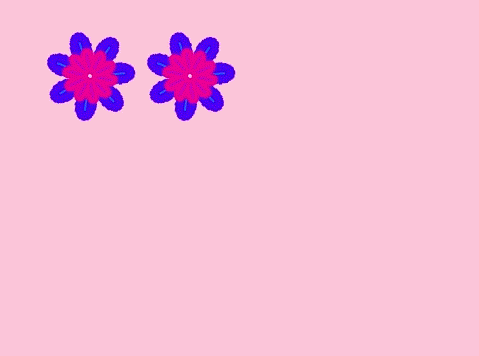

## Motifs floraux

Tu peux également utiliser ton bloc `dessiner une fleur`{:class="block3myblocks"} pour créer des motifs de fleurs soignés.

--- task ---

Crée une fleur ou une combinaison de fleurs que tu aimes. Voici un exemple:


```blocks3
when [p v] key pressed
erase all
go to x: (-150) y: (100)
dessiner une fleur (150) (80) (7) :: custom
dessiner une fleur (130) (35) (20) :: custom
```

--- /task ---

--- task ---

Appuie sur <kbd>p</kbd> pour voir ta fleur. L'exemple ressemble à ceci:


--- /task ---

Avant de pouvoir créer ton motif, tu dois effacer la scène des restes de fleurs.

--- task ---

Clique sur le bloc `effacer tout` dans l'onglet «Stylo».

```blocks3
erase all
```

--- /task ---

--- task ---

Fais un clic droit sur le sprite Fleur et `cacher`{:class="block3looks"} afin qu'il n'apparaisse pas sur la scène. (Tu peux `montrer`{:class="block3looks"} le sprite à nouveau si tu dois voir où il se trouve.)

--- /task ---

--- task ---

Maintenant dessine une rangée de ces fleurs à travers le haut de la scène. Voici un exemple de code dans lequel tu pourrais avoir besoin d'ajuster les chiffres pour qu'il fonctionne avec ta fleur :


```blocks3
when [p v] key pressed
erase all
go to x: (-150) y: (100)
repeat (4) 
  dessiner une fleur (150) (80) (7) :: custom
  dessiner une fleur (130) (35) (20) :: custom
  change x by (100)
end
```

--- /task ---

--- task ---

Appuie sur `p` pour voir une ligne de fleurs:


--- /task ---

--- task ---

Ajoute une autre boucle pour créer plus de lignes de fleurs. Cet exemple ajoute une boucle `répéter 3`{:class="block3control"} pour créer trois lignes.


```blocks3
when [p v] key pressed
erase all
go to x: (-150) y: (100)
repeat (3) 
  repeat (4) 
    dessiner une fleur (150) (80) (7) :: custom
    dessiner une fleur (130) (35) (20) :: custom
    change x by (100)
  end
  set x to (-150)
  change y by (-100)
end
```

--- /task ---

--- task ---

Appuie sur <kbd>p</kbd> pour créer une grille de fleurs:


--- /task ---

Veux-tu accélérer le dessin des fleurs?

--- task ---

Fais un clic droit sur le bloc de définition `dessiner une fleur`{:class="block3myblocks"}, puis clique sur **modifier**. Clique sur la case **Exécuter sans rafraîchir l'écran**.


Maintenant, les fleurs sont dessinées plus rapidement.

--- /task ---

Tu peux également changer la couleur de la scène.

--- task ---

Clique sur **Choisir un arrière-plan**, puis clique sur **Peindre**. Crée un arrière-plan orange en utilisant l'outil Remplissage en mode Bitmap.


Si tu utilises l'orange pour l'arrière-plan et le sprite Fleur, alors les nombres pour différentes couleurs correspondent pour le sprite et l'arrière-plan.

--- /task ---

--- task ---

Maintenant tu peux utiliser `définir l'effet de couleur`{:class="block3looks"} sur la scène pour changer la couleur de l'arrière-plan.


```blocks3
when [p v] key pressed
set [color v] effect to (30)
```

--- /task ---

--- task ---

Essaie de créer un motif que tu aimes.

Voici un exemple:


--- /task ---

Lorsque tu mets tout cela ensemble, tu peux créer un effet incroyable:

