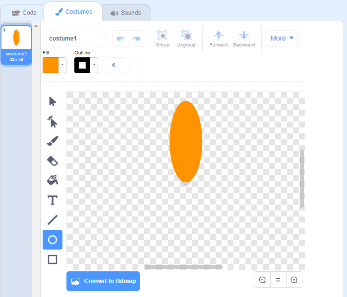
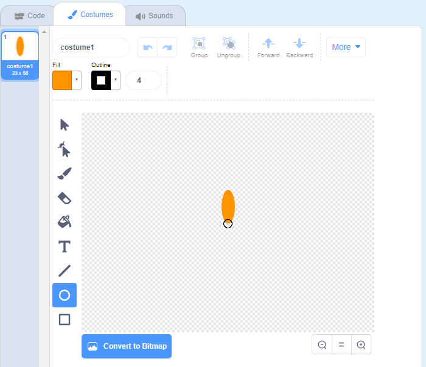

## फूल उत्पन्न करें

पहले आप एक फूल उत्पन्न करने जा रहे हैं जिसे स्टेज पर बनाया जा सकता है।

\--- task \---

एक नया Scratch प्रोजेक्ट बनाएँ, और कैट स्प्राइट को हटा दें।

[[[generic-scratch3-new-project]]]

\--- /task \---

\--- task \---

अपने प्रोजेक्ट में Pen एक्सटेंशन जोड़ें।

[[[generic-scratch3-add-pen-extension]]]

\--- /task \---

\--- task \---

अब फूल की पंखुड़ी के आकार का एक नया स्प्राइट बनाने के लिए Paint (पेंट) टूल का उपयोग करें।

**Choose a sprite** (स्प्राइट चुनें) पर क्लिक करें, फिर **Paint** (पेंट) पर क्लिक करें और स्प्राइट 'फूल' का नाम बदलें।

[[[generic-scratch3-draw-sprite]]]

\--- /task \---

\--- task \---

नारंगी रंग वाली पंखुड़ी की आकृति बनाने के लिए Circle (सर्किल) टूल का उपयोग करें।



बाद में, आप अधिक रंग जोड़ने के लिए कोड का उपयोग करेंगे।

\--- /task \---

\--- task \---

फूल को घुमाकर बनाई गई समान आकार की छह पंखुड़ियों वाले फूल पर `stamp`{:class="block3extensions"} मोहर लगाने के लिए स्प्राइट फूल में निम्नलिखित कोड जोड़ें `when the green flag is clicked`{:class="block3control"}।


```blocks3
when green flag clicked
repeat (6) 
  stamp
  turn cw (60) degrees
end
```

\--- /task \---

आप देख सकते हैं कि आपकी पंखुड़ियों को अजीब तरीके से व्यवस्थित किया गया है:


ऐसा इसलिए है क्योंकि स्प्राइट को इसके केंद्र के चारों ओर घुमाया जा रहा है।

\--- task \---

अपनी पंखुड़ी को हिलाएँ ताकि उसका तल केंद्र में हो।



यदि आप ज़ूम आउट करते हैं तो ऐसा करना आसान हो सकता है।

\--- /task \---

अपना कोड दुबारा चलाने से पहले, आपको स्टेज को साफ करने के लिए स्प्राइट्स को `erase all`{:class="block3extensions"} से मिटा देना चाहिए।

\--- task \---

Pen (पेन) ब्लॉक सेक्शन में `erase all` ब्लॉक पर क्लिक करें।

```blocks3
erase all
```

\--- /task \---

\--- task \---

यह जाँचने के लिए अपना कोड फिर से चलाएँ कि फूल की पंखुड़ियाँ अब सीधी हैं।


ऐसा न हो तो, पंखुड़ी का नीचे का हिस्सा जब तक केंद्र में न आ जाए तब तक इसकी स्थिति को समायोजित करें।

\--- /task \---