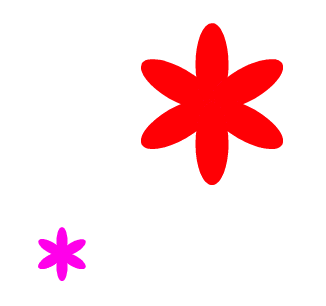

## अपने फूलों को कस्टमाइज़ करें

फिलहाल आपके द्वारा बनाए गए सभी फूल बिल्कुल एक जैसे हैं। इसके बाद आप `draw flower`{:class="block3myblocks"} ब्लॉक में कुछ इनपुट जोड़ने जा रहे हैं ताकि आप विभिन्न रंगों, आकारों और अधिक पंखुड़ियों वाले फूल बना सकें।

--- task ---

Scratch में स्प्राइट का रंग बदलने के लिए आप `set colour effect`{:class="block3looks"} ब्लॉक का उपयोग कर सकते हैं।

रंग बदलने के लिए अपने 'draw flower' की परिभाषा बदलें:


```blocks3
define draw flower
set [color v] effect to (150)
repeat (6) 
  stamp
  turn cw (60) degrees
end
```

--- /task ---

--- task ---

विभिन्न रंगों के फूलों को देखने के लिए अपना कोड चलाएँ।


`set colour effect`{:class="block3looks"} स्प्राइट के डिफ़ॉल्ट रंग के आधार पर रंग बदलता है, इसलिए यदि आपका स्प्राइट नारंगी रंग को शुरू नहीं करता है, तो आपको अलग परिणाम मिलते हैं।

--- /task ---

--- task ---

`set colour effect`{:class="block3looks"} ब्लॉक में, `0` से `199` तक विभिन्न संख्याओं का उपयोग करके प्रयोग करें और देखें कि आपको कौन से अलग-अलग परिणाम मिलते हैं।

--- /task ---

फिलहाल सभी फूल एक ही रंग के हैं। प्रत्येक फूल को एक अलग रंग देने के लिए, आपको `draw flower`{:class="block3myblocks"} ब्लॉक में एक **input** (इनपुट) जोड़ना होगा।

--- task ---

`draw flower`{:class="block3myblocks"} definition block (परिभाषा ब्लॉक) पर राइट-क्लिक करें और **edit** (संपादन) चुनें:


--- /task ---

--- task ---

अब 'colour' (रंग) नामक एक **input number** (इनपुट संख्या) जोड़ें:


इनपुट `draw flower`{:class="block3myblocks"} परिभाषा में दिखाई देती है, और आप इसे उस स्थान पर खींच सकते हैं जहाँ आप इसका उपयोग करना चाहते हैं।

--- /task ---

--- task ---

'colour' (रंग) इनपुट को `set colour effect`{:class="block3looks"} ब्लॉक में खींचें:


आपका कोड इस प्रकार दिखना चाहिए:


```blocks3
define draw flower (colour)
set [color v] effect to (colour :: custom-arg)
repeat (6)
  stamp
  turn cw (60) degrees
end
```

--- /task ---

ध्यान दें कि आपके `draw flower`{:class="block3myblocks"} ब्लॉक्स में अब एक नया इनपुट है जो `1` पर सेट है:

```blocks3
when green flag clicked
erase all
go to x: (75) y: (75)
draw flower (1) :: custom
go to x: (-75) y: (-75)
draw flower (1) :: custom
```

--- task ---

`draw flower`{:class="block3myblocks"} ब्लॉकों में संख्याएँ बदलें ताकि दोनों फूल अलग-अलग रंगों में दिखाई दें। आप 0 और 200 के बीच किसी भी संख्या को चुन सकते हैं।

आपका कोड इससे मिलता-जुलता दिखना चाहिए:


```blocks3
when green flag clicked
erase all
go to x: (75) y: (75)
draw flower (180) :: custom
go to x: (-75) y: (-75)
draw flower (150) :: custom
```

--- /task ---

--- task ---

अब फूल का आकार सेट करने के लिए एक और इनपुट जोड़ें, ताकि आपका `draw flower`{:class="block3myblocks"} ब्लॉक इस तरह का दिखाई दे:


```blocks3
draw flower (180) (150) :: custom
```

उपरोक्त ब्लॉक के साथ, आप अलग-अलग आकारों के फूल बना सकते हैं:



--- hints ---


--- hint ---

देखें कि आपने `colour` इनपुट जोड़ने के लिए क्या किया है, और 'आकार' (size) इनपुट जोड़ने के लिए इसे दोहराएँ जिसका उपयोग आप फूल स्प्राइट के आकार को सेट करने के लिए कर सकते हैं।

--- /hint ---

--- hint ---

'आकार' नामक एक नया नंबर इनपुट जोड़ने के लिए `draw flower`{:class="block3myblocks"} ब्लॉक को संपादित करें।

आपको `draw flower`{:class="block3myblocks"} परिभाषा ब्लॉक में 'size' (आकार) इनपुट के साथ निम्नलिखित ब्लॉक को जोड़ना होगा:

```blocks3
set size to (100) %
```

--- /hint ---

--- hint ---

`draw flower`{:class="block3myblocks"} definition block (परिभाषा ब्लॉक) पर राइट-क्लिक करें, **edit** (संपादन) पर क्लिक करें, और 'size' (आकार) नामक संख्या इनपुट जोड़ें।


अपनी `define draw flower`{:class="block3myblocks"} स्क्रिप्ट को बदलें ताकि यह इस तरह दिखाई दे:

```blocks3
define draw flower (colour) (size :: custom-arg)
set [color v] effect to (colour :: custom-arg)
set size to (size :: custom-arg) %
repeat (6) 
  stamp
  turn cw (60) degrees
end
```

--- /hint ---

--- /hints ---

--- /task --- 
--- task ---

`when green flag clicked`{:class="block3events"} स्क्रिप्ट, दोनों में दूसरा नंबर बदलें `draw flower`{:class="block3myblocks"} ब्लॉक ताकि दो फूल विभिन्न आकारों में दिखाई देते हैं।

```blocks3
when green flag clicked
erase all
go to x: (75) y: (75)
draw flower (180) (150) :: custom
go to x: (-75) y: (-75)
draw flower (150) (50) :: custom
```

--- /task ---

--- task ---

अपने कोड का परीक्षण यह जांचने के लिए करें कि क्या फूलों के अलग-अलग आकार हैं।

--- /task ---

--- task ---

यह फूल की पंखुड़ियों की संख्या का चयन करने के लिए अच्छा होगा।

एक और इनपुट जोड़ें ताकि आप इस तरह से फूल खींच सकें:


--- hints ---
--- hint ---

आपको एक 'petals' नंबर इनपुट जोड़ने की जरूरत है, और फिर इसका उपयोग `define draw flower`{:class="block3myblocks"} ब्लॉक में करें।

ऐसी दो जगहें हैं जहाँ आपको 'पंखुड़ियों' (petals) के इनपुट को जोड़ना होगा।

फ्लावर स्प्राइट की संख्या `turn`{:class="block3looks"} द्वारा होनी चाहिए `360` पंखुड़ियों की संख्या से विभाजित।

--- /hint ---

--- hint ---

इस तरह दिखने के लिए अपने `define draw flower`{:class="block3myblocks"} ब्लॉक बदलें:


```blocks3
define draw flower (colour) (size :: custom-arg) (petals)
```

अपने `repeat`{:class="block3control"} और `turn`{:class="block3looks"} ब्लॉकों को अपडेट करें ताकि वे 'पंखुड़ियों' (petals) इनपुट का उपयोग करें।

```blocks3
repeat (petals :: custom-arg) 
end

turn cw ((360) / (petals :: custom-arg)) degrees
```

अपने `draw flower`{:class="block3myblocks"} ब्लॉकों को 'पंखुड़ियों' (petals) इनपुट का उपयोग करने के लिए अपडेट करें।

```blocks3
draw flower (150) (50) (8) :: custom
```

--- /hint ---

--- hint ---

अपने `परिभाषित ड्रा फूल को संपादित करें`{:class="block3myblocks"} ब्लॉक करें और 'पंखुड़ियों' नामक एक नया नंबर इनपुट जोड़ें।


आपका कोड इस तरह दिखना चाहिए:

```blocks3
define draw flower (colour) (size :: custom-arg) (petals)
set [color v] effect to (colour :: custom-arg)
set size to (size :: custom-arg) %
repeat (petals :: custom-arg) 
  stamp
  turn cw ((360) / (petals :: custom-arg)) degrees
end

```

`when green flag clicked`{:class="block3events"} स्क्रिप्ट में, दोनों में तीसरा नंबर बदलें `draw flower`{:class="block3myblocks"} ब्लॉक ताकि दिखने वाले दो फूलों में अलग-अलग पंखुड़ियों की संख्या होती है।

```blocks3
when green flag clicked
erase all
go to x: (75) y: (75)
draw flower (180) (150) (3) :: custom
go to x: (-75) y: (-75)
draw flower (150) (50) (8) :: custom
```

--- /hint ---

--- /hints ---

--- /task ---

अगला, अपना कोड संपादित करें ताकि आप <kbd>f</kbd> कुंजी दबाकर विभिन्न फूलों को आकर्षित कर सकें।

--- task ---

अब अपने कोड को `when green flag clicked`{:class="block3events"} ब्लॉक के नीचे से हटाएँ और कोड को `when f key pressed`{:class="block3events"} ब्लॉक के नीचे जोड़ें।


```blocks3
when green flag clicked
```

```blocks3
when [f v] key pressed
erase all
go to x: (75) y: (75)
draw flower (180) (150) (3) :: custom
go to x: (-75) y: (-75)
draw flower (150) (50) (8) :: custom
```

--- /task ---

--- task ---

अपने कोड का परीक्षण करने के लिए <kbd>f</kbd> दबाएं।

--- /task ---

--- task ---

चरण में सभी अलग-अलग रंगों, आकारों और पंखुड़ियों की संख्या के साथ फूलों को खींचने के लिए अपने प्रोग्राम में अधिक `draw flower`{:class="block3myblocks"} जोड़ें।

--- /task ---