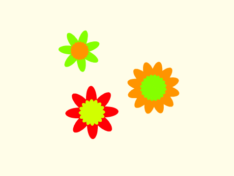

## चुनौती: एक फूल का डिज़ाइन बनाएँ

क्या आप अधिक फूल बनाने और एक दिलचस्प डिज़ाइन बनाने के लिए अपने `draw flower`{:class="block3myblocks"} ब्लॉक का कई बार उपयोग कर सकते हैं? एक ही स्थान पर विभिन्न फूल बनाना एक दिलचस्प प्रभाव पैदा करता है।

अपनी पसंद का कोई डिज़ाइन बनाएँ। यहाँ एक उदाहरण है:

आपको गोल आकार की पंखुड़ियों का उपयोग करने की आवश्यकता नहीं है। उदाहरण के लिए, आप इस तरह का आतिशबाज़ी (फायरवर्क) पैटर्न बनाने के लिए मोटी सीधी रेखाओं और एक काली पृष्ठभूमि का उपयोग कर सकते हैं:

आतिशबाज़ी पैटर्न के लिए 'पंखुड़ी' सिर्फ एक लाइन है:

नई पंखुड़ियों के परिधान जोड़ें और देखें कि आप कौन से फूलों को पेश कर सकते हैं।

एक ऐसे स्प्राइट आकार की कोशिश करें जिसे भरा न गया हो, जैस कोई चौकोर, और देखें कि क्या होता है

