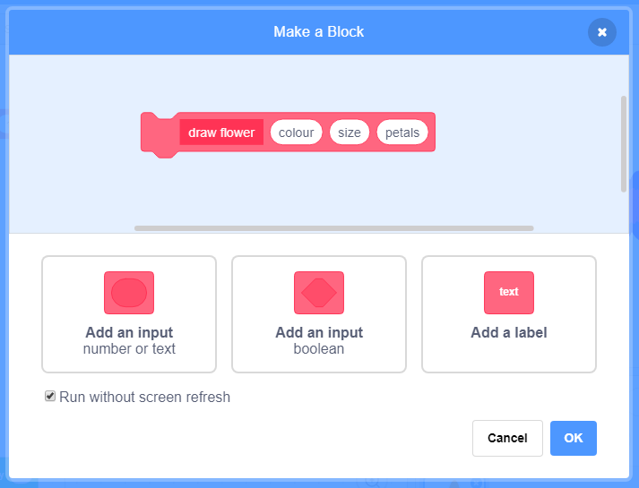

## फूल के पैटर्न

फूलों के साफ-सुथरे पैटर्न बनाने के लिए आप अपने `draw flower`{:class="block3myblocks"} ब्लॉक का भी उपयोग कर सकते हैं।

--- task ---

अपनी पसंद का कोई फूल या फूलों का संयोजन बनाएँ। यहाँ एक उदाहरण है:


```blocks3
when [p v] key pressed
erase all
go to x: (-150) y: (100)
draw flower (150) (80) (7) :: custom
draw flower (130) (35) (20) :: custom
```

--- /task ---

--- task ---

अपने फूल को देखने के लिए <kbd>p</kbd> दबाएँ। उदाहरण इस तरह दिखता है:


--- /task ---

इससे पहले कि आप अपना पैटर्न बना सकें, आपको स्टेज पर किन्हीं बचे हुए फूलों को साफ कर देना चाहिए।

--- task ---

Pen (पेन) टैब में `erase all` ब्लॉक पर क्लिक करें।

```blocks3
सभी मिटाएँ
```

--- /task ---

--- task ---

फूल स्प्राइट पर राइट-क्लिक करें और इसे `hide`{:class="block3looks"} करें ताकि यह स्टेज पर दिखाई न दे। (आप स्प्राइट को फिर से `show`{:class="block3looks"} कर सकते हैं यदि आपको यह देखने की जरूरत पड़े कि यह कहाँ पर है।)

--- /task ---

--- task ---

अब स्टेज पर ऊपर की तरफ इन फूलों की एक पंक्ति बनाएँ। यहाँ एक उदाहरण कोड है, जिसमें आपको संख्याओं को समायोजित करने की जरूरत पड़ सकती है ताकि यह आपके फूल के साथ काम कर सके:


```blocks3
when [p v] key pressed
erase all
go to x: (-150) y: (100)
repeat (4) 
  draw flower (150) (80) (7) :: custom
  draw flower (130) (35) (20) :: custom
  change x by (100)
end
```

--- /task ---

--- task ---

फूलों की पंक्ति को देखने के लिए `p` दबाएँ।


--- /task ---

--- task ---

फूलों की अधिक पंक्तियाँ बनाने के लिए एक और लूप जोड़ें। यह उदाहरण तीन पंक्तियाँ बनाने के लिए एक `repeat 3`{:class="block3control"} लूप जोड़ता है।


```blocks3
when [p v] key pressed
erase all
go to x: (-150) y: (100)
repeat (3) 
  repeat (4) 
    draw flower (150) (80) (7) :: custom
    draw flower (130) (35) (20) :: custom
    change x by (100)
  end
  set x to (-150)
  change y by (-100)
end
```

--- /task ---

--- task ---

फूलों का एक ग्रिड बनाने के लिए <kbd>p</kbd> दबाएँ:


--- /task ---

क्या आप फूलों को बनाने की गति को तेज़ करना चाहते हैं?

--- task ---

`ड्रा फ्लॉवर `{:class="block3myblocks"} परिभाषा ब्लॉक पर राइट-क्लिक करें और फिर **संपादित करें** पर क्लिक करें। **स्क्रीन रिफ्रेश किए बिना चलाएं** बॉक्स पर क्लिक करें।



अब फूल अधिक तेज़ी से खींचे जाते हैं।

--- /task ---

आप स्टेज का रंग भी बदल सकते हैं

--- task ---

**एक पृष्ठभूमि चुनें** पर क्लिक करें, और फिर **पेंट** पर क्लिक करें। बिटमैप मोड में भरण उपकरण का उपयोग करके एक नारंगी पृष्ठभूमि बनाएं।


यदि आप बैकड्रॉप और फ्लावर स्प्राइट के लिए नारंगी का उपयोग करते हैं, तो विभिन्न रंगों के लिए नंबर स्प्राइट और बैकड्रॉप के लिए मेल खाएंगे।

--- /task ---

--- task ---

अब आप बैकड्रॉप के रंग को बदलने के लिए स्टेज पर `सेट रंग प्रभाव`{:class="block3looks"} का उपयोग कर सकते हैं


```blocks3
when [p v] key pressed
set [color v] effect to (30)
```

--- /task ---

--- task ---

अपनी पसंद का पैटर्न बनाने की कोशिश करें।

यहाँ एक उदाहरण है:


--- /task ---

जब आप यह सब एक साथ रखते हैं, तो आप एक अद्भुत प्रभाव बना सकते हैं:

