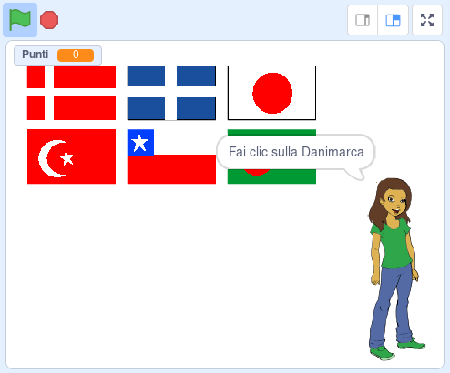

## E adesso?

Prova il nostro progetto [Indovina la bandiera](https://projects.raspberrypi.org/it-IT/projects/guess-the-flag?utm_source=pathway&utm_medium=whatnext&utm_campaign=projects), potrai creare un quiz sulle bandiere per sfidare te stesso e i tuoi amici.

--- no-print ---

Fai clic sulla bandiera della nazione che ti viene chiesta.

  <iframe allowtransparency="true" width="485" height="402" src="https://scratch.mit.edu/projects/embed/276891625/?autostart=false" frameborder="0" scrolling="no"></iframe>

--- /no-print ---

--- print-only ---

--- /print-only ---

***
Questo progetto è stato tradotto da volontari:

Giacomo Magisano

Omar Lazzari

Grazie ai volontari, possiamo offrire alle persone di tutto il mondo la possibilità di imparare nella loro lingua. Puoi aiutarci a raggiungere più persone offrendoti come volontario per la traduzione - puoi trovare maggiori informazioni su [rpf.io/translate](https://rpf.io/translate).