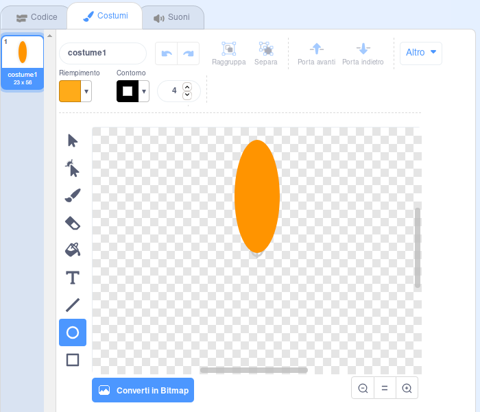
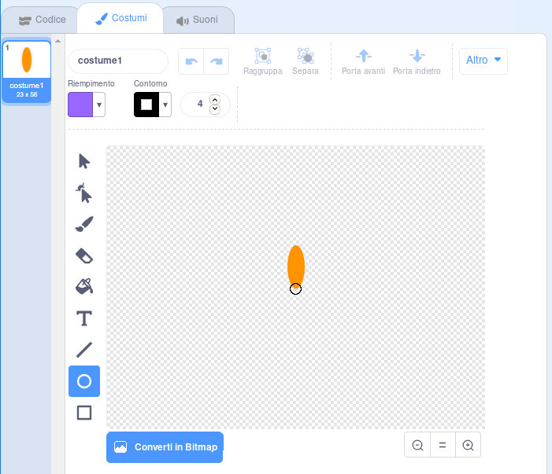

## Crea un fiore

Per prima cosa creeremo un fiore che può essere disegnato sullo sfondo.

--- task ---

Crea un nuovo progetto Scratch ed elimina lo sprite del gatto.

[[[generic-scratch3-new-project]]]

--- /task ---

--- task ---

Aggiungi l'estensione Penna al tuo progetto.

[[[generic-scratch3-add-pen-extension]]]

--- /task ---

--- task ---

Ora usa lo strumento di disegno per creare un nuovo sprite a forma di petalo.

Fai clic su **Scegli uno sprite**, quindi scegli **Disegna un nuovo sprite** e rinomina lo sprite in 'Fiore'.

[[[generic-scratch3-draw-sprite]]]

--- /task ---

--- task ---

Usa lo strumento Cerchio per disegnare una forma che assomigli ad un petalo riempita di arancione.



Più tardi, userai il codice per aggiungere più colori.

--- /task ---

--- task ---

Aggiungi questo codice allo sprite Fiore per stampare con `timbra`{:class="block3extensions"} un fiore con sei petali ruotati a intervalli regolari `quando si clicca sulla bandiera verde`{:class="block3control"}.


```blocks3
when green flag clicked
repeat (6) 
  stamp
  turn cw (60) degrees
end
```

--- /task ---

Potresti scoprire che i tuoi petali sono disposti in modo strano:


Questo succede perché lo sprite viene ruotato intorno al suo centro.

--- task ---

Muovi il tuo petalo in modo che il suo fondo coincida con il centro dello sprite.



Può riuscirci più facilmente allargando la vista.

--- /task ---

Prima di eseguire di nuovo il codice, dovresti cancellare con `pulisci`{:class="block3extensions"} gli stampi dello sprite sullo sfondo.

--- task ---

Fai clic sul blocco `pulisci` nella sezione Penna.

```blocks3
erase all
```

--- /task ---

--- task ---

Esegui di nuovo il codice e controlla che i petali del fiore adesso siano dritti.


In caso contrario, aggiusta la posizione del petalo fino a che il suo fondo non è proprio al centro dello sprite.

--- /task ---