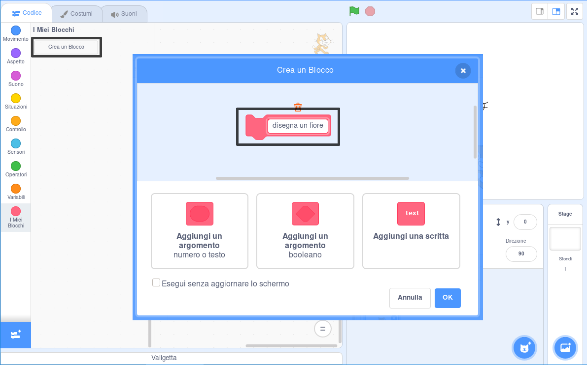

## Crea un blocco personalizzato per disegnare i fiori

E se volessi disegnare molti fiori? Invece di fare molte copie del codice, crea il tuo blocco Scratch da usare ogni volta che vorrai disegnare un fiore.

--- task ---

Fai clic su **I miei blocchi** e poi su **Crea un blocco** per creare il tuo blocco chiamato 'disegna un fiore'.



--- /task ---

--- task ---

Ora c'è un nuovo blocco chiamato `disegna un fiore`{:class="block3myblocks"} nella sezione **I Miei Blocchi** e un nuovo blocco di definizione sullo stage.

```blocks3
disegna un fiore :: custom

define disegna un fiore
```

--- /task ---

--- task ---

Sposta il codice per disegnare il fiore dal blocco `quando si clicca sulla bandiera verde`{:class="block3events"} al nuovo blocco di definizione `disegna un fiore`{:class="block3myblocks"}.

Il tuo codice dovrebbe apparire così:


```blocks3
define disegna un fiore
repeat (6) 
  stamp
  turn cw (60) degrees
end

when green flag clicked
```

--- /task ---

--- task ---

Aggiungi questo codice per cancellare lo Stage e per usare il tuo nuovo blocco `disegna un fiore`{:class="block3myblocks"} quando si clicca sulla bandiera verde:


```blocks3
when green flag clicked
erase all
disegna un fiore :: custom
```

--- /task ---

--- task ---

Fai clic sulla bandiera verde per testare il tuo codice e controlla se vedi un fiore.

--- /task ---

--- task ---

Ora cambia il tuo codice per spostare lo sprite e disegnare un altro fiore:


```blocks3
when green flag clicked
erase all
go to x: (75) y: (75)
disegna un fiore :: custom
go to x: (-75) y: (-75)
disegna un fiore :: custom 
```

--- /task ---

--- task ---

Prova il tuo codice e verifica di vedere due fiori.


--- /task ---