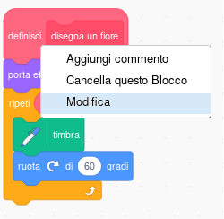
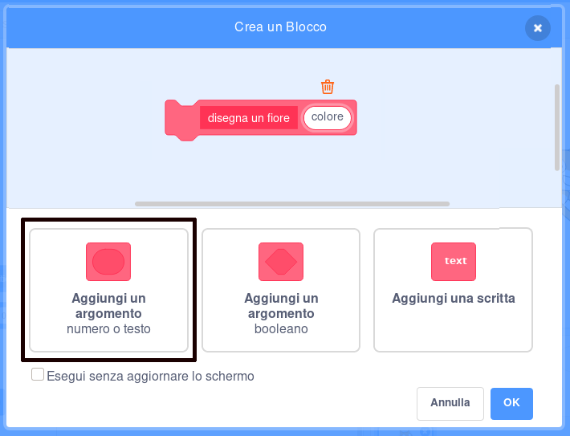
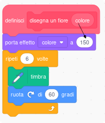
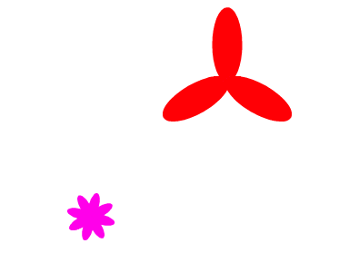

## Personalizza i tuoi fiori

Per ora tutti i fiori che disegni sono perfettamente uguali. Proviamo ad aggiungere alcuni parametri al blocco `disegna un fiore`{:class="block3myblocks"} per poter disegnare fiori con colore, dimensione e numero di petali diversi.

--- task ---

In Scratch puoi usare il blocco `porta effetto colore a`{:class="block3looks"} per cambiare il colore di uno sprite.

Modifica la definizione del tuo 'disegna un fiore' per cambiare il colore:


```blocks3
define disegna un fiore
set [color v] effect to (150)
repeat (6) 
  stamp
  turn cw (60) degrees
end
```

--- /task ---

--- task ---

Esegui il tuo codice per vedere i fiori di un colore diverso.


il blocco `porta effetto colore a`{:class="block3looks"} cambia il colore dello sprite in base al suo colore originale, quindi se inizialmente il tuo sprite non è arancione, otterrai un risultato diverso.

--- /task ---

--- task ---

Prova a usare numeri diversi da `0` a `199` in `porta effetto colore a`{:class="block3looks"} e vedi quali risultati si ottengono.

--- /task ---

Per ora i fiori sono tutti dello stesso colore. Per dare ad ogni fiore un colore diverso, devi aggiungere un **argomento** al blocco `disegna un fiore`{:class="block3myblocks"}.

--- task ---

Fai clic con il tasto destro del mouse sul blocco di definizione `disegna un fiore`{:class="block3myblocks"} e scegli **modifica**:



--- /task ---

--- task ---

Aggiungi un **argomento** chiamato 'colore':



L'argomento apparirà nella definizione di `disegna un fiore`{:class="block3myblocks"}, e potrai trascinarlo dove vorrai usarlo.

--- /task ---

--- task ---

Trascina l'argomento 'colore' sul blocco `porta effetto colore a`{:class="block3looks"}:



Il tuo codice dovrebbe apparire così:


```blocks3
define disegna un fiore (colore)
set [color v] effect to (colore :: custom-arg)
repeat (6)
  stamp
  turn cw (60) degrees
end
```

--- /task ---

Nota che i tuoi blocchi `disegna un fiore`{:class="block3myblocks"} ora hanno un nuovo input impostato a `1`:

```blocks3
when green flag clicked
erase all
go to x: (75) y: (75)
disegna un fiore (1) :: custom
go to x: (-75) y: (-75)
disegna un fiore (1) :: custom
```

--- task ---

Cambia i numeri nei blocchi `disegna un fiore`{:class="block3myblocks"} in modo che i due fiori appaiano in colori diversi. Puoi scegliere qualsiasi numero tra 0 e 200.

Il tuo codice dovrebbe apparire così:


```blocks3
when green flag clicked
erase all
go to x: (75) y: (75)
disegna un fiore (180) :: custom
go to x: (-75) y: (-75)
disegna un fiore (150) :: custom
```

--- /task ---

--- task ---

Ora aggiungi un altro input per impostare la dimensione del fiore, il tuo blocco `disegna un fiore`{:class="block3myblocks"} dovrebbe assomigliare a questo:


```blocks3
disegna un fiore (180) (150) :: custom
```

Con il blocco qui sopra, è possibile creare fiori di diverse dimensioni:


--- hint ---

--- hint ---

Guarda quello che hai fatto per aggiungere l'argomento `colore`. e usalo come traccia per aggiungere un argomento 'dimensione' per impostare la dimensione dello sprite Fiore.

--- /hint ---

--- hint ---

Modifica il blocco `disegna un fiore`{:class="block3myblocks"} per aggiungere un nuovo argomento numerico chiamato 'dimensione'.

Devi aggiungere questo blocco con un parametro 'dimensione' alla definizione del blocco `disegna un fiore`{:class="block3myblocks"}:

```blocks3
set size to (100) %
```

--- /hint ---

--- hint ---

Fai clic con il tasto destro del mouse sul blocco di definizione `disegna un fiore`{:class="block3myblocks"}, poi su **modifica**, e infine aggiungi un argomento numerico chiamato 'dimensione'.


Cambia lo script `definisci disegna un fiore`{:class="block3myblocks"} in modo che assomigli a questo:

```blocks3
define disegna un fiore (colore) (dimensione :: custom-arg)
set [color v] effect to (colore :: custom-arg)
set size to (dimensione :: custom-arg) %
repeat (6) 
  stamp
  turn cw (60) degrees
end
```

--- /hint ---

--- /hints ---

--- /task --- --- task ---

Nello script `quando si clicca sulla bandierina verde`{:class="block3events"}, cambia il secondo numero in entrambi i blocchi `disegna un fiore`{:class="block3myblocks"} in modo che i due fiori appaiano di diverse dimensioni.

```blocks3
when green flag clicked
erase all
go to x: (75) y: (75)
disegna un fiore (180) (150) :: custom
go to x: (-75) y: (-75)
disegna un fiore (150) (50) :: custom
```

--- /task ---

--- task ---

Prova il tuo codice e verifica che i fiori abbiano dimensioni diverse.

--- /task ---

--- task ---

Sarebbe bello scegliere il numero dei petali dei fiori.

Aggiungi un altro argomento per poter disegnare i fiori in questo modo:



--- hints ---
 --- hint ---

Bisogna aggiungere un argomento 'petali' al blocco `definisci disegna un fiore`{:class="block3myblocks"} e usarlo all'interno del codice.

Ci sono due posti in cui bisogna usare l'argomento 'petali'.

Lo sprite Fiore dovrebbe `ruotare` di `360` gradi diviso per il numero di petali.

--- /hint ---

--- hint ---

Cambia il tuo blocco `definisci disegna un fiore`{:class="block3myblocks"} in modo che sia simile a questo:


```blocks3
define disegna un fiore (colore) (dimensione :: custom-arg) (petali)
```

Aggiorna i tuoi blocchi `ripeti`{:class="block3control"} e `ruota`{:class="block3looks"} in modo che utilizzino l'argomento 'petali'.

```blocks3
repeat (petali :: custom-arg) 
end

turn cw ((360) / (petali :: custom-arg)) degrees
```

Aggiorna i tuoi blocchi `disegna un fiore`{:class="block3myblocks"} usando l'argomento 'petali'.

```blocks3
disegna un fiore (150) (50) (8) :: custom
```

--- /hint ---

--- hint ---

Modifica il tuo blocco `definisci disegna un fiore`{:class="block3myblocks"} e aggiungi un nuovo argomento chiamato 'petali'.


Il tuo codice dovrebbe apparire così:

```blocks3
define disegna un fiore (colore) (dimensione :: custom-arg) (petali)
set [color v] effect to (colore :: custom-arg)
set size to (dimensione :: custom-arg) %
repeat (petali :: custom-arg) 
  stamp
  turn cw ((360) / (petali :: custom-arg)) degrees
end

```

Nello script `quando si clicca sulla bandierina verde`{:class="block3events"}, cambia il terzo numero in entrambi i blocchi `disegna un fiore`{:class="block3myblocks"} in modo che i due fiori che appaiono abbiano un numero di petali diverso tra loro.

```blocks3
when green flag clicked
erase all
go to x: (75) y: (75)
disegna un fiore (180) (150) (3) :: custom
go to x: (-75) y: (-75)
disegna un fiore (150) (50) (8) :: custom
```

--- /hint ---

--- /hints ---

--- /task ---

Adesso, modifica il codice per poter disegnare diversi fiori premendo il tasto <kbd>f</kbd>.

--- task ---

Sposta il codice per disegnare i fiori da sotto il blocco `quando si clicca la bandierina verde`{:class="block3events"}, e metti il codice sotto un blocco `quando si preme il tasto f`{:class="block3events"}.


```blocks3
quando si clicca sulla bandiera verde
```

```blocks3
when [f v] key pressed
erase all
go to x: (75) y: (75)
disegna un fiore (180) (150) (3) :: custom
go to x: (-75) y: (-75)
disegna un fiore (150) (50) (8) :: custom
```

--- /task ---

--- task ---

Premi <kbd>f</kbd> per testare il tuo codice.

--- /task ---

--- task ---

Aggiungi più blocchi `disegna un fiore`{:class="block3myblocks"} al tuo programma per disegnare fiori con colori, dimensioni e numeri di petali diversi per tutto lo Stage.

--- /task ---