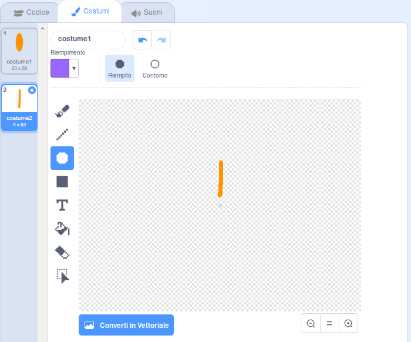

## Sfida: crea un disegno floreale

Puoi usare il tuo blocco `disegna un fiore`{:class="block3myblocks"} più volte per disegnare più fiori e creare un motivo interessante? Disegnare fiori diversi nella stessa posizione crea un effetto interessante.

Crea un disegno che ti piace. Ecco un esempio:

Non devi per forza usare petali a forma di ellissi. Per esempio, puoi usare linee dritte spesse e uno sfondo nero per creare un motivo di fuochi d'artificio come questo:

Il 'petalo' per il modello di fuochi d'artificio è solo una linea:

Aggiungi nuovi costumi petalo e guarda quali fiori puoi inventare.

Prova ad usare una forma con l'interno trasparente, come un quadrato, e vedi cosa succede

