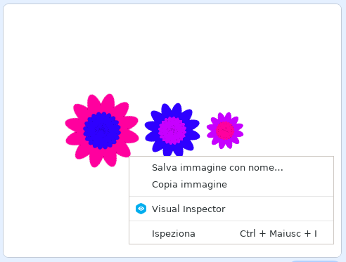

## Salva le tue immagini

Quando crei un'immagine che ti piace, puoi salvarla e usarla in un altro progetto Scratch, come salvaschermo, o su un sito Web.

\--- task \---

Quando c'è un'immagine sullo Stage che ti piace, fai clic con il tasto destro del mouse e poi seleziona **salva immagine con nome**

**Nota:** su alcuni computer o browser, l'opzione di menu per salvare l'immagine potrebbe avere un nome diverso.

Adesso, puoi salvare un'immagine PNG dello Stage.

\--- /task \---