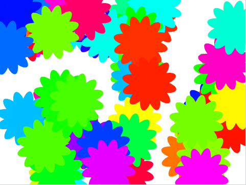

## Generatore casuale di fiori

Ora utilizzeremo il tuo blocco `disegna un fiore`{:class="block3myblocks"} per creare un centinaio di fiori diversi su tutto lo stage ogni volta che premi <kbd>r</kbd>.


--- task ---

Aggiungi un nuovo blocco di eventi al codice del tuo sprite in modo che `quando si preme il tasto r`{:class="block3events"}, lo schermo viene `cancellato`{:class="block3extensions"}.


```blocks3
when [r v] key pressed
erase all
```

--- /task ---

--- task ---

Aggiungi in un blocco `ripeti`{:class="block3control"} `100` volte un blocco `raggiungi posizione a caso`{:class="block3motion"}.


```blocks3
repeat (100)
  go to (random position v)
end
```

--- /task ---

--- task ---

Usa il blocco `disegna un fiore`{:class="block3myblocks"} per creare un fiore con un colore `a caso`{:class="block3operators"} tra `0` e `199`.

Il tuo codice dovrebbe assomigliare a questo:


```blocks3
when [r v] key pressed
erase all
repeat (100) 
  go to (random position v)
  disegna un fiore (pick random (0) to (199)) (100) (12) :: custom
end
```

--- /task ---

Questo codice crea cento fiori con colori diversi ma con le stesse dimensioni e lo stesso numero di petali.



--- task ---

Puoi modificare lo script `quando si preme il tasto r`{:class="block3events"} in modo che anche le dimensioni dei fiori e il numero dei loro petali siano casuali?

--- hints ---

--- hint ---

Il blocco `disegna un fiore`{:class="block3myblocks"} dovrebbe scegliere un `numero a caso`{:class="block3operators"} per dimensione e numero di petali.

--- /hint ---

--- hint ---

I seguenti blocchi scelgono a caso una dimensione tra `50` e `150` e un numero di petali compreso tra `4` e `12`.


```blocks3
(pick random (50) to (150))

(pick random (4) to (12))
```

--- /hint ---

--- hint ---

Il tuo codice dovrebbe apparire così:


```blocks3
when [r v] key pressed
erase all
repeat (100) 
  go to (random position v)
  disegna un fiore (pick random (0) to (199)) (pick random (50) to (150)) (pick random (4) to (12)) :: custom
end
```

--- /hint ---

--- /hints ---

--- /task ---

--- task ---

Premi <kbd>r</kbd> per vedere i tuoi fiori casuali.

--- /task ---