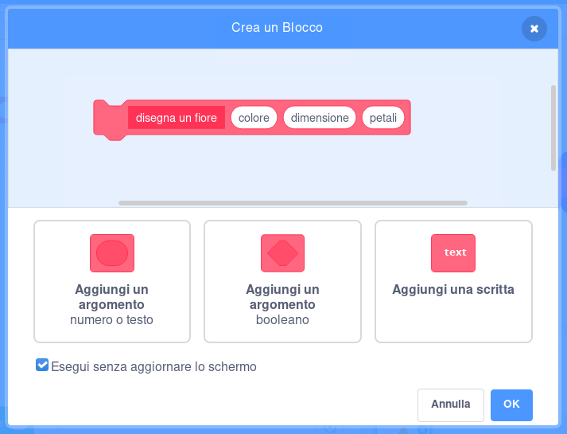
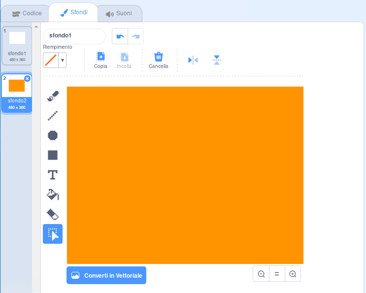

## Motivi floreali

Puoi usare il tuo blocco `disegna un fiore`{:class="block3myblocks"} anche per creare dei bei motivi floreali.

--- task ---

Crea un fiore o una combinazione di fiori che ti piace. Ecco un esempio:


```blocks3
when [p v] key pressed
erase all
go to x: (-150) y: (100)
disegna un fiore (150) (80) (7) :: custom
disegna un fiore (130) (35) (20) :: custom
```

--- /task ---

--- task ---

Premi <kbd>p</kbd> per vedere il tuo fiore. L'esempio è simile a questo:


--- /task ---

Prima di creare il vostro motivo, dovreste cancellare dallo Stage tutti i fiori rimasti.

--- task ---

Fare clic sul blocco `pulisci` nella sezione Penna.

```blocks3
erase all
```

--- /task ---

--- task ---

Fai clic con il tasto destro del mouse sullo sprite Fiore e `nascondi`{:class="block3looks"} per non farlo apparire sullo Stage. (Puoi usare `mostra`{:class="block3looks"} di nuovo se hai bisogno di vedere dov'è lo sprite.)

--- /task ---

--- task ---

Ora disegna una fila di questi fiori nella parte alta dello Stage. Qui sotto riportiamo un codice d'esempio, potresti dover cambiare i numeri per adattarlo al tuo fiore:


```blocks3
when [p v] key pressed
erase all
go to x: (-150) y: (100)
repeat (4) 
  disegna un fiore (150) (80) (7) :: custom
  disegna un fiore (130) (35) (20) :: custom
  change x by (100)
end
```

--- /task ---

--- task ---

Premi `p` per vedere una fila di fiori:


--- /task ---

--- task ---

Aggiungi un altro ciclo per creare altre file di fiori. Questo esempio aggiunge un blocco `ripeti 3`{:class="block3control"} per creare tre righe.


```blocks3
when [p v] key pressed
erase all
go to x: (-150) y: (100)
repeat (3) 
  repeat (4) 
    disegna un fiore (150) (80) (7) :: custom
    disegna un fiore (130) (35) (20) :: custom
    change x by (100)
  end
  set x to (-150)
  change y by (-100)
end
```

--- /task ---

--- task ---

Premi <kbd>p</kbd> per creare una griglia di fiori:


--- /task ---

Vuoi disegnare i fiori più velocemente?

--- task ---

Fai clic con il tasto destro del mouse sul blocco di definizione `disegna un fiore`{:class="block3myblocks"} e poi fai clic su **modifica**. Spunta la casella **Esegui senza aggiornare lo schermo**.



Ora i fiori vengono disegnati più rapidamente.

--- /task ---

Puoi anche cambiare il colore dello stage.

--- task ---

Clicca su **Scegli uno sfondo**, e poi su **Disegna un nuovo sfondo**. Crea uno sfondo arancione usando lo strumento Riempimento (secchiello) in modalità Bitmap.



Se usi l'arancione per lo sfondo e lo sprite Fiore, i numeri dei i diversi colori dello sprite e dello sfondo corrisponderanno.

--- /task ---

--- task ---

Ora puoi usare il blocco `imposta effetto colore a`{:class="block3looks"} sullo Stage per cambiare il colore dello sfondo.


```blocks3
when [p v] key pressed
set [color v] effect to (30)
```

--- /task ---

--- task ---

Prova a creare un motivo che ti piace.

Ecco un esempio:


--- /task ---

Se combini tutto, puoi creare un effetto sorprendente:

