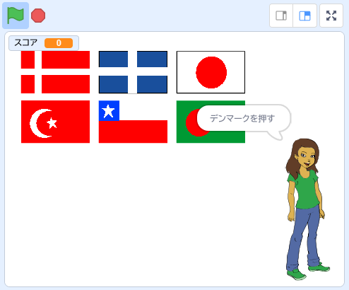

## 次は何をしますか？

[国旗当て](https://projects.raspberrypi.org/ja-JP/projects/guess-the-flag?utm_source=pathway&utm_medium=whatnext&utm_campaign=projects)プロジェクトをやってみましょう。自分や友だちを試す国旗クイズを作れます。

--- no-print ---

聞かれている国の国旗をクリックしましょう。

  <iframe allowtransparency="true" width="485" height="402" src="https://scratch.mit.edu/projects/embed/276891625/?autostart=false" frameborder="0" scrolling="no"></iframe>

--- /no-print ---

--- print-only ---

--- /print-only ---

***
このプロジェクトは以下のボランティアによって翻訳されました。

齊藤哲哉

大野 雅利

ボランティアのおかげで、世界中の人々に母国語で学ぶ機会を与えることができます。翻訳を引き受けていただくことで、より多くの人々に手を差し伸べることができます。詳しくは [rpf.io/translate](https://rpf.io/translate) をご覧ください。