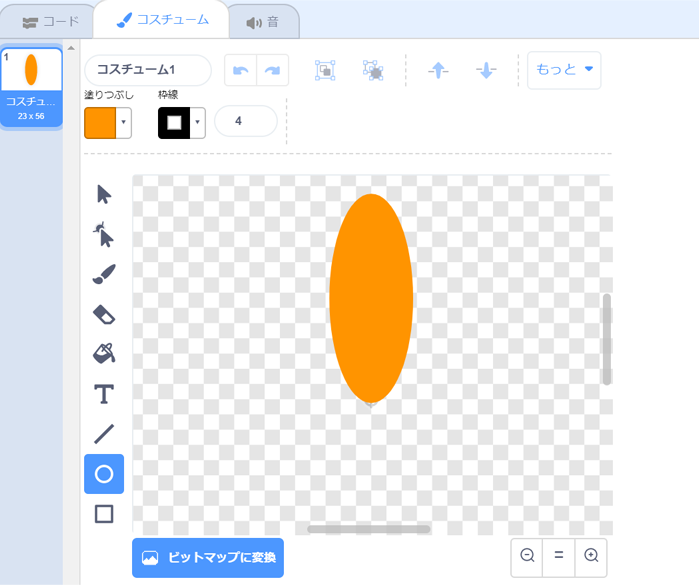
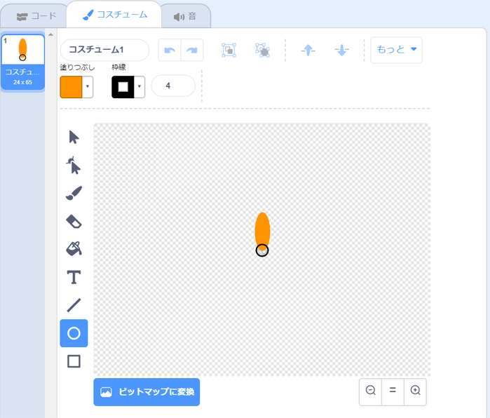

## 花をつくりだす

まず、ステージに描（えが）ける花をつくってみましょう。

\--- task \---

新しいScratchプロジェクトを作成し、ネコのスプライトを消します。

[[[generic-scratch3-new-project]]]

\--- /task \---

\--- task \---

プロジェクトにペン拡張機能（かくちょうきのう）を追加します。

[[[generic-scratch3-add-pen-extension]]]

\--- /task \---

\--- task \---

次に、ペイントツールを使って花びらのような形をした新しいスプライトをつくります。

**スプライトを選ぶ**をクリックし、次に**描（えが）く**をクリックしてスプライトの名前を「花」にかえます。

[[[generic-scratch3-draw-sprite]]]

\--- /task \---

\--- task \---

円ツールを使って橙（だいだい）色でぬりつぶした花びらの形を描（えが）きます。



あとでプログラムを使って色を増やします。

\--- /task \---

\--- task \---

次のプログラムを花のスプライトに追加すると、`緑の旗が押されたとき`{:class="block3control"}、同じ角度で並んだ6つの花びらがある花を`スタンプ`{:class="block3extensions"}します。


```blocks3
when green flag clicked
repeat (6) 
  stamp
  turn cw (60) degrees
end
```

\--- /task \---

花びらが変なふうに並べられていることに気付くでしょう。


これは、スプライトがその中心(ちゅうしん)のまわりを回っているからです。

\--- task \---

花びらの下の部分が中心になるように花びらを動かします。



ズームアウトすると簡単になります。

\--- /task \---

プログラムを実行する前に、ステージをきれいにするためにステージ上のスプライトを`全部消す`{:class="block3extensions"}必要があります。

\--- task \---

ペンブロック項目にある`全部消す`ブロックをクリックします。

```blocks3
erase all
```

\--- /task \---

\--- task \---

プログラムをもう一度実行し、今回は花びらがきれいに並んでいることを確認しましょう。


そうなってないときは、花びらの下の部分が真ん中になるまで花びらの位置を調節します。

\--- /task \---