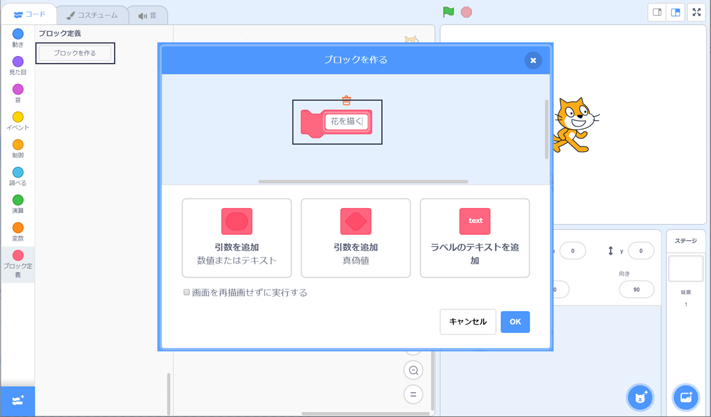

## 花を描（えが）く独自のブロックをつくる

花をたくさん描（えが）きたいときはどうしますか？ 同じプログラムをたくさんコピーするのでなく、Scratchに独自のブロックを作り、花を描（えが）きたいときにはその作ったブロックを使うようにします。

--- task ---

**ブロック定義**をクリックし、**ブロックを作る**をクリックして「花を描く」ブロックを作ります。



--- /task ---

--- task ---

**ブロック定義**のところに新しい`花を描く`{:class="block3myblocks"}ブロックがあり、ステージに新しい定義ブロックがあります。

```blocks3
花を描く :: custom

define 花を描く
```

--- /task ---

--- task ---

花を描（えが）くためのプログラムを`緑の旗が押されたとき`{:class="block3events"}ブロックから`花を描く`{:class="block3myblocks"}定義ブロックに移動します。

コードは次のようになります：


```blocks3
define 花を描く
repeat (6) 
  stamp
  turn cw (60) degrees
end

when green flag clicked
```

--- /task ---

--- task ---

次のプログラムを追加して、緑の旗を押したときにステージをクリアし、新しい`花を描く`{:class="block3myblocks"}ブロックを使います。


```blocks3
when green flag clicked
erase all
花を描く :: custom
```

--- /task ---

--- task ---

緑の旗を押してプログラムを試し、花が表示されるか確かめましょう。

--- /task ---

--- task ---

今度はプログラムを変更してスプライトを動かし、別の花を描（えが）いてみましょう。


```blocks3
when green flag clicked
erase all
go to x: (75) y: (75)
花を描く :: custom
go to x: (-75) y: (-75)
花を描く :: custom 
```

--- /task ---

--- task ---

プログラムを試して、2つの花が表示されることを確かめましょう。


--- /task ---