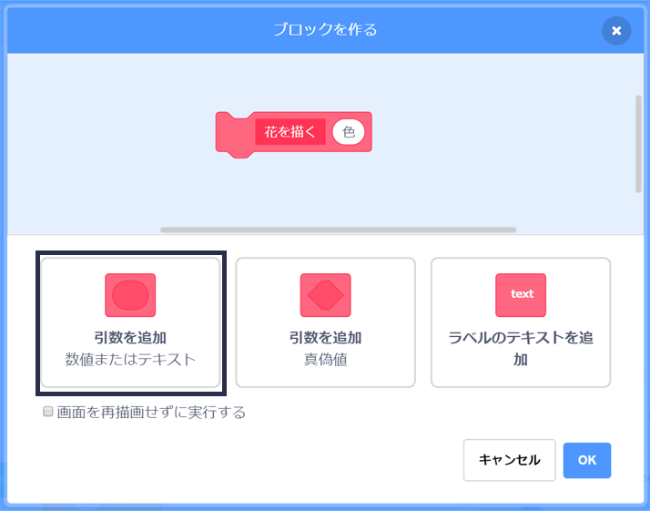
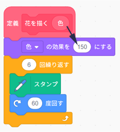

## 花をつくり直してみる

ここまででは、描（えが）かれる花はすべて同じ花になっています。 次は`花を描く`{:class="block3myblocks"}ブロックに引数をいくつか追加して、さまざまな色や大きさ、花びらの数の花を描（えが）くようにしましょう。

\--- task \---

Scratchでは、スプライトの色を変えるのに`色の効果を〜にする`{:class="block3looks"} ブロックが使えます。

「花を描く」の定義を変更して、色を変えてみましょう。


```blocks3
define draw flower
set [color v] effect to (150)
repeat (6) 
  stamp
  turn cw (60) degrees
end
```

\--- /task \---

\--- task \---

プログラムを実行して、さまざまな色の花を確かめましょう。


`色の効果を〜にする`{:class="block3looks"} はスプライトの最初の色に基づいて色を変えるので、スプライトの色が橙（だいだい）色から始まっていないときは違う結果になります。

\--- /task \---

\--- task \---

`色の効果を〜にする`{:class="block3looks"}ブロックの中の数字を`0`から`199`まで変えて実験し、どのような結果になるか確かめてみましょう。

\--- /task \---

現在、花はすべて同じ色になっています。 それぞれの花を別の色にするために、`花を描く`{:class="block3myblocks"}ブロックに**引数**を追加する必要があります。

\--- task \---

`花を描く`{:class="block3myblocks"}定義ブロックを右クリックし、**編集**を選びます。


\--- /task \---

\--- task \---

次に「色」という名前で**数値の引数**を追加します。



`花を描く`{:class="block3myblocks"}定義に引数が表示され、使いたい場所にドラッグできます。

\--- /task \---

\--- task \---

引数「色」を `色の効果を〜にする`{:class="block3looks"}ブロックにドラッグします：



プログラムは次のようになります：


```blocks3
define draw flower (colour)
set [color v] effect to (colour :: custom-arg)
repeat (6)
  stamp
  turn cw (60) degrees
end
```

\--- /task \---

ここで`花を描く`{:class="block3myblocks"}ブロックに`1`に設定された新しい引数があることに注意してください。

```blocks3
when green flag clicked
erase all
go to x: (75) y: (75)
draw flower (1) :: custom
go to x: (-75) y: (-75)
draw flower (1) :: custom
```

\--- task \---

`花を描く`{:class="block3myblocks"}ブロックにある数値を変更し、2つの花が違う色で表示されるようにしましょう。 数値は0から200までのどれでも良いです。

コードは次のようになります：


```blocks3
when green flag clicked
erase all
go to x: (75) y: (75)
draw flower (180) :: custom
go to x: (-75) y: (-75)
draw flower (150) :: custom
```

\--- /task \---

\--- task \---

次に、花の大きさを設定する別の引数を追加すると、`花を描く`{:class="block3myblocks"}ブロックは次のようになります：


```blocks3
draw flower (180) (150) :: custom
```

上のブロックを使うと、大きさの違う花を作ることができます。


\--- hints \---

\--- hint \---

引数`色`を追加するためにやったことを見て、それを繰り返して花のスプライトの大きさを設定するのに使う引数「大きさ」を追加します。

\--- /hint \---

\--- hint \---

`花を描く`{:class="block3myblocks"}ブロックを編集して、新しい数値の引数「大きさ」を追加します。

引数「大きさ」を持つ次のブロックを`花を描く`{:class="block3myblocks"}定義ブロックに追加する必要があります。

```blocks3
set size to (100) %
```

\--- /hint \---

\--- hint \---

`花を描く`{:class="block3myblocks"}定義ブロックを右クリックし、**編集**をクリックし、「大きさ」という数値の引数を追加します。


`定義 花を描く`{:class="block3myblocks"}スクリプトを次のように変更します：

```blocks3
define draw flower (colour) (size :: custom-arg)
set [color v] effect to (colour :: custom-arg)
set size to (size :: custom-arg) %
repeat (6) 
  stamp
  turn cw (60) degrees
end
```

\--- /hint \---

\--- /hints \---

\--- /task \--- \--- task \---

`緑の旗が押されたとき`{:class="block3events"}スクリプトで、両方の`花を描く`{:class="block3myblocks"}ブロックの2番目の数値を変更し、2つの花が違う大きさで表示されるようにします。

```blocks3
when green flag clicked
erase all
go to x: (75) y: (75)
draw flower (180) (150) :: custom
go to x: (-75) y: (-75)
draw flower (150) (50) :: custom
```

\--- /task \---

\--- task \---

プログラムを試して、花の大きさが違うか確かめましょう。

\--- /task \---

\--- task \---

花にある花びらの枚数が選べるとかっこいいですね。

次のように花を描けるように別の引数を追加します：


\--- hints \--- \--- hint \---

「花びら」という数値の引数を追加し、`花を描く`{:class="block3myblocks"}ブロックで使う必要があります。

引数「花びら」を追加する必要がある場所は2つあります。

花のスプライトを`回す`{:class="block3looks"}角度は`360`を花びらの数で割ったものです。

\--- /hint \---

\--- hint \---

`定義 花を描く`{:class="block3myblocks"}ブロックを次のように変更します：


```blocks3
define draw flower (colour) (size :: custom-arg) (petals)
```

`繰り返す`{:class="block3control"}ブロックと`回す`{:class="block3looks"}ブロックを更新し、引数「花びら」を使うようにします。

```blocks3
repeat (petals :: custom-arg) 
end

turn cw ((360) / (petals :: custom-arg)) degrees
```

`花を描く`{:class="block3myblocks"}ブロックを更新し、引数「花びら」を使うようにします。

```blocks3
draw flower (150) (50) (8) :: custom
```

\--- /hint \---

\--- hint \---

`定義 花を描く`{:class="block3myblocks"}ブロックを編集し、「花びら」という新しい数値の引数を追加します。


コードは次のようになります：

```blocks3
define draw flower (colour) (size :: custom-arg) (petals)
set [color v] effect to (colour :: custom-arg)
set size to (size :: custom-arg) %
repeat (petals :: custom-arg) 
  stamp
  turn cw ((360) / (petals :: custom-arg)) degrees
end

```

`緑の旗を押したとき`{:class="block3events"}スクリプトで、両方の`花を描く`{:class="block3myblocks"}にある3番目の数値を変更し、2つの花の花びらの枚数が違うようにします。

```blocks3
when green flag clicked
erase all
go to x: (75) y: (75)
draw flower (180) (150) (3) :: custom
go to x: (-75) y: (-75)
draw flower (150) (50) (8) :: custom
```

\--- /hint \---

\--- /hints \---

\--- /task \---

次に、プログラムを変更し、<kbd>f</kbd>キーを押したときにさまざまな花を描（えが）けるようにします。

\--- task \---

`緑の旗が押されたとき`{:class="block3events"}ブロックの下から花を描（えが）くプログラムを移動し、`fキーが押されたとき`{:class="block3events"}ブロックの下に置きます。


```blocks3
when green flag clicked
```

```blocks3
when [f v] key pressed
erase all
go to x: (75) y: (75)
draw flower (180) (150) (3) :: custom
go to x: (-75) y: (-75)
draw flower (150) (50) (8) :: custom
```

\--- /task \---

\--- task \---

<kbd>f</kbd>キーを押してプログラムを試します。

\--- /task \---

\--- task \---

さらに`花を描く`{:class="block3myblocks"}ブロックをプログラムに追加して、ステージ全体にさまざまな色、大きさ、花びらの枚数で花を描（えが）いてみましょう。

\--- /task \---