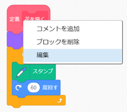

## 花をつくり直してみる

ここまででは、描（えが）かれる花はすべて同じ花になっています。 次は`花を描く`{:class="block3myblocks"}ブロックに引数をいくつか追加して、さまざまな色や大きさ、花びらの数の花を描（えが）くようにしましょう。

\--- task \---

Scratchでは、スプライトの色を変えるのに`色の効果を〜にする`{:class="block3looks"} ブロックが使えます。

「花を描く」の定義を変更して、色を変えてみましょう。


```blocks3
define draw flower
set [color v] effect to (150)
repeat (6) 
  stamp
  turn cw (60) degrees
end
```

\--- /task \---

\--- task \---

プログラムを実行して、さまざまな色の花を確かめましょう。


`色の効果を〜にする`{:class="block3looks"} はスプライトの最初の色に基づいて色を変えるので、スプライトの色が橙（だいだい）色から始まっていないときは違う結果になります。

\--- /task \---

\--- task \---

`色の効果を〜にする`{:class="block3looks"}ブロックの中の数字を`0`から`199`まで変えて実験し、どのような結果になるか確かめてみましょう。

\--- /task \---

現在、花はすべて同じ色になっています。 それぞれの花を別の色にするために、`花を描く`{:class="block3myblocks"}ブロックに**引数**を追加する必要があります。

\--- task \---

`花を描く`{:class="block3myblocks"}定義ブロックを右クリックし、**編集**を選びます。



\--- /task \---

\--- task \---

次に「色」という名前で**数値の引数**を追加します。


`花を描く`{:class="block3myblocks"}定義に引数が表示され、使いたい場所にドラッグできます。

\--- /task \---

\--- task \---

引数「色」を `色の効果を〜にする`{:class="block3looks"}ブロックにドラッグします：


プログラムは次のようになります：


```blocks3
define draw flower (colour)
set [color v] effect to (colour :: custom-arg)
repeat (6)
  stamp
  turn cw (60) degrees
end
```

\--- /task \---

ここで`花を描く`{:class="block3myblocks"}ブロックに`1`に設定された新しい引数があることに注意してください。

```blocks3
when green flag clicked
erase all
go to x: (75) y: (75)
draw flower (1) :: custom
go to x: (-75) y: (-75)
draw flower (1) :: custom
```

\--- task \---

`花を描く`{:class="block3myblocks"}ブロックにある数値を変更し、2つの花が違う色で表示されるようにしましょう。 数値は0から200までのどれでも良いです。

コードは次のようになります：


```blocks3
when green flag clicked
erase all
go to x: (75) y: (75)
draw flower (180) :: custom
go to x: (-75) y: (-75)
draw flower (150) :: custom
```

\--- /task \---

\--- task \---

次に、花の大きさを設定する別の引数を追加すると、`花を描く`{:class="block3myblocks"}ブロックは次のようになります：


```blocks3
draw flower (180) (150) :: custom
```

上のブロックを使うと、大きさの違う花を作ることができます。


\--- hints \---

\--- hint \---

引数`色`を追加するためにやったことを見て、それを繰り返して花のスプライトの大きさを設定するのに使う引数「大きさ」を追加します。

\--- /hint \---

\--- hint \---

`花を描く`{:class="block3myblocks"}ブロックを編集して、新しい数値の引数「大きさ」を追加します。

You need to add the following block with a 'size' input to the `draw flower`{:class="block3myblocks"} definition block:

```blocks3
set size to (100) %
```

\--- /hint \---

\--- hint \---

Right-click on the `draw flower`{:class="block3myblocks"} definition block, click on **edit**, and add a number input called 'size'.


Change your `define draw flower`{:class="block3myblocks"} script so it looks like this:

```blocks3
define draw flower (colour) (size :: custom-arg)
set [color v] effect to (colour :: custom-arg)
set size to (size :: custom-arg) %
repeat (6) 
  stamp
  turn cw (60) degrees
end
```

\--- /hint \---

\--- /hints \---

\--- /task \--- \--- task \---

In the `when green flag clicked`{:class="block3events"} script, change the second number in both `draw flower`{:class="block3myblocks"} blocks so that the two flowers appear in different sizes.

```blocks3
when green flag clicked
erase all
go to x: (75) y: (75)
draw flower (180) (150) :: custom
go to x: (-75) y: (-75)
draw flower (150) (50) :: custom
```

\--- /task \---

\--- task \---

Test your code to check whether the flowers have different sizes.

\--- /task \---

\--- task \---

It would be cool to choose the number of petals the flowers have.

Add another input so that you can draw flowers like this:


\--- hints \--- \--- hint \---

You need to add a 'petals' number input, and then use it in the `define draw flower`{:class="block3myblocks"} block.

There are two places where you need to add the 'petals' input.

The number of degrees the Flower sprite should `turn`{:class="block3looks"} by is `360` divided by the number of petals.

\--- /hint \---

\--- hint \---

Change your `define draw flower`{:class="block3myblocks"} block to look like this:


```blocks3
define draw flower (colour) (size :: custom-arg) (petals)
```

Update your `repeat`{:class="block3control"} and `turn`{:class="block3looks"} blocks so they use the 'petals' input.

```blocks3
repeat (petals :: custom-arg) 
end

turn cw ((360) / (petals :: custom-arg)) degrees
```

Update your `draw flower`{:class="block3myblocks"} blocks to use the 'petals' input.

```blocks3
draw flower (150) (50) (8) :: custom
```

\--- /hint \---

\--- hint \---

Edit your `define draw flower`{:class="block3myblocks"} block and add a new number input called 'petals'.


Your code should look like this:

```blocks3
define draw flower (colour) (size :: custom-arg) (petals)
set [color v] effect to (colour :: custom-arg)
set size to (size :: custom-arg) %
repeat (petals :: custom-arg) 
  stamp
  turn cw ((360) / (petals :: custom-arg)) degrees
end

```

In the `when green flag clicked`{:class="block3events"} script, change the third number in both `draw flower`{:class="block3myblocks"} blocks so that the two flowers that appear have different numbers of petals.

```blocks3
when green flag clicked
erase all
go to x: (75) y: (75)
draw flower (180) (150) (3) :: custom
go to x: (-75) y: (-75)
draw flower (150) (50) (8) :: custom
```

\--- /hint \---

\--- /hints \---

\--- /task \---

Next, edit your code so you can draw different flowers by pressing the <kbd>f</kbd> key.

\--- task \---

Now move your code for drawing flowers away from below the `when green flag clicked`{:class="block3events"} block, and put the code under a `when f key pressed`{:class="block3events"} block.


```blocks3
when green flag clicked
```

```blocks3
when [f v] key pressed
erase all
go to x: (75) y: (75)
draw flower (180) (150) (3) :: custom
go to x: (-75) y: (-75)
draw flower (150) (50) (8) :: custom
```

\--- /task \---

\--- task \---

Press <kbd>f</kbd> to test your code.

\--- /task \---

\--- task \---

Add more `draw flower`{:class="block3myblocks"} blocks to your program to draw flowers with different colours, sizes, and numbers of petals all over the Stage.

\--- /task \---