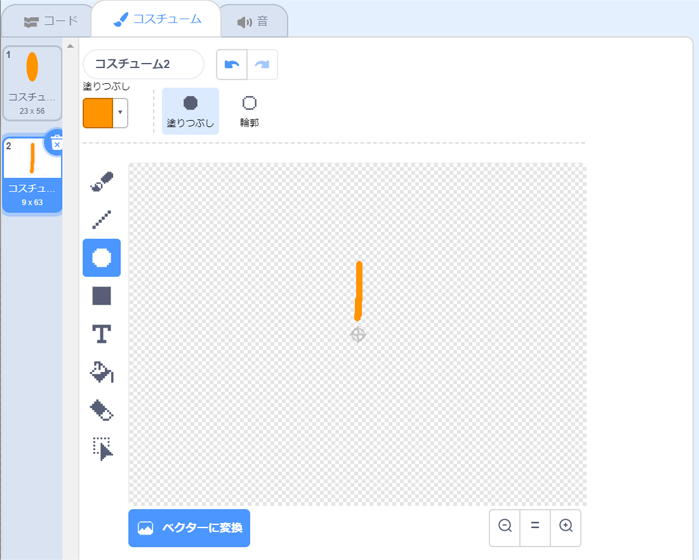

## チャレンジ：花の図柄(ずがら)をつくる

`花を描く`{:class="block3myblocks"}ブロックを何回か使って、たくさんの花を描いて面白い図柄を作ることができますか？ 同じ場所に違う花を描（えが）くと面白い効果が生まれます。

好きな図柄をつくりましょう。 次に例を示します：

楕円形（だえんけい）の花びらを使う必要はありません。 たとえば、太い直線と黒い背景を利用して、次のような花火の模様をつくれます：

花火の模様の「花びら」は単なる線です。

新しい花びらのコスチュームを追加して、どんな花になるか見てみましょう。

正方形のような塗りつぶされていない形のスプライトを試して、何が起きるか確かめてください。

