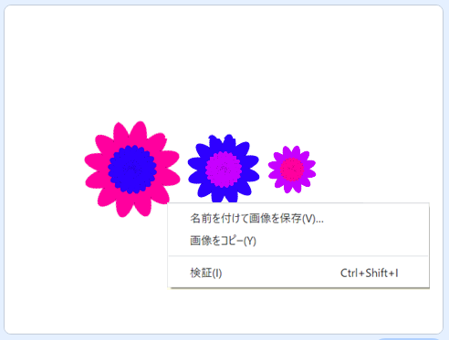

## 画像を保存する

気に入った画像ができたら、それを保存して他のScratchプロジェクトで使ったり、スクリーンセーバーとして使ったり、ウェブサイトで使えます。

--- task ---

好きな画像がステージにある場合は、その画像を右クリックして、**名前を付けて画像を保存**をクリックします。

**注意：**一部のコンピュータやブラウザでは、画像を保存するためのメニュー表示が違っている場合があります。

ステージの画像をPNG形式で保存できます。

--- /task ---