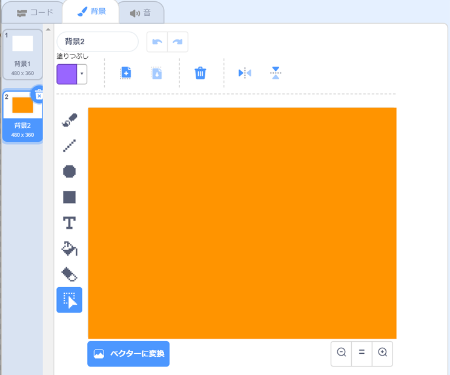

## 花の模様（もよう）

`花を描く`{:class="block3myblocks"}ブロックは、すてきな花の模様（もよう）をつくるのにも使えます。

\--- task \---

好きな花や花の組み合わせをつくりましょう。 次に例を示します：


```blocks3
when [p v] key pressed
erase all
go to x: (-150) y: (100)
draw flower (150) (80) (7) :: custom
draw flower (130) (35) (20) :: custom
```

\--- /task \---

\--- task \---

<kbd>p</kbd>キーを押すと花が表示されます。 例は次のようになります：


\--- /task \---

模様（もよう）をつくる前に、ステージに残っている花を消しておきましょう。

\--- task \---

ペンのタブにある`全部消す`ブロックをクリックします。

```blocks3
erase all
```

\--- /task \---

\--- task \---

花のスプライトを右クリックして、`隠す`{:class="block3looks"}ことで、ステージに表示されないようにします。 （スプライトがどこにあるか確かめる必要がある場合は、もう一度`表示する`{:class="block3looks"}ことができます。）

\--- /task \---

\--- task \---

ここでステージの上の方に花の列を描（えが）きます。 次にプログラムの例を示しますが、あなたがつくった花でうまく動くように数値を調整する必要があるかもしれません：


```blocks3
when [p v] key pressed
erase all
go to x: (-150) y: (100)
repeat (4) 
  draw flower (150) (80) (7) :: custom
  draw flower (130) (35) (20) :: custom
  change x by (100)
end
```

\--- /task \---

\--- task \---

`p`キーを押すと並んだ花が表示されます。


\--- /task \---

\--- task \---

もう一つ繰り返しを追加して、花の並びをふやします。 この例では`3回繰り返す`{:class="block3control"}を追加して、3行にしています。


```blocks3
when [p v] key pressed
erase all
go to x: (-150) y: (100)
repeat (3) 
  repeat (4) 
    draw flower (150) (80) (7) :: custom
    draw flower (130) (35) (20) :: custom
    change x by (100)
  end
  set x to (-150)
  change y by (-100)
end
```

\--- /task \---

\--- task \---

<kbd>p</kbd>キーを押すと、花が格子状（こうしじょう）に並びます。


\--- /task \---

花を描（えが）くのを速くしたいですか？

\--- task \---

`花を描く`{:class="block3myblocks"}定義ブロックを右クリックし、**編集**をクリックします。 **画面を再描画せずに実行する**チェックボックスをクリックします。


すると、花が速く描（えが）かれます。

\--- /task \---

ステージの色も変えられます。

\--- task \---

**背景を選ぶ**をクリックし、**描く**をクリックします。 ビットマップモードで塗りつぶしツールを使って橙（だいだい）色の背景を作ります。



背景と花のスプライトに橙（だいだい）色を使うと、異なる色の数値はスプライトと背景で同じになります。

\--- /task \---

\--- task \---

ここで背景の色を変えるのにステージにある`色の効果を〜にする`{:class="block3looks"}を使うことができます。


```blocks3
when [p v] key pressed
set [color v] effect to (30)
```

\--- /task \---

\--- task \---

好きな模様（もよう）をつくってみましょう。

次に例を示します：


\--- /task \---

すべてを組み合わせると、すばらしい効果を生み出すことができます。

