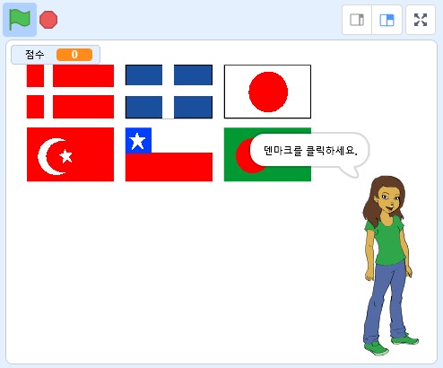

## 더 나아가기

깃발 퀴즈를 만들어 나와 내 친구들을 시험해볼 수 있는 [깃발 맞추기](https://projects.raspberrypi.org/en/projects/guess-the-flag?utm_source=pathway&utm_medium=whatnext&utm_campaign=projects) 프로젝트에 도전해보세요.

\--- no-print \---

질문 받은 나라의 국기를 클릭해보세요.

  <iframe allowtransparency="true" width="485" height="402" src="https://scratch.mit.edu/projects/embed/276891625/?autostart=false" frameborder="0" scrolling="no"></iframe>

\--- /no-print \---

\--- print-only \---

\--- /print-only \---