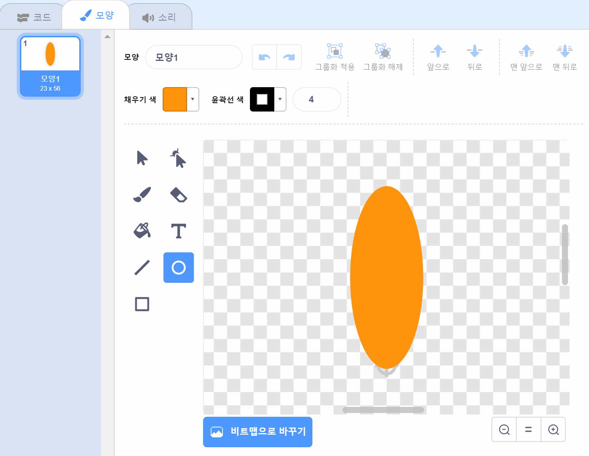
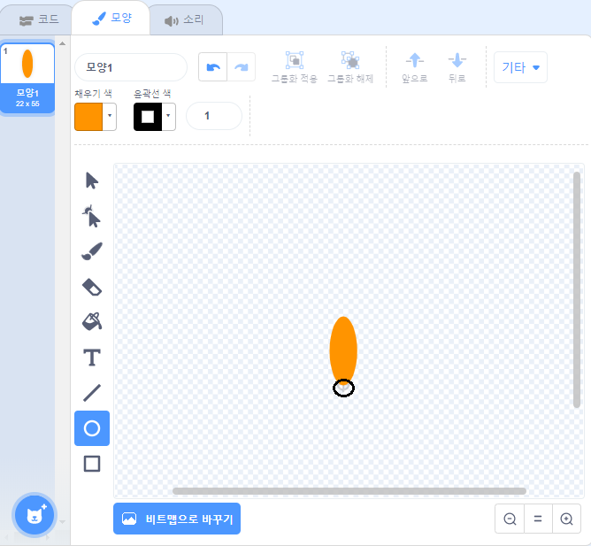

## 꽃 만들기

먼저 스테이지에서 그릴 수 있는 꽃을 만듭니다.

--- task ---

새 스크래치 프로젝트를 만들고 고양이 스프라이트를 삭제하세요.

[[[generic-scratch3-new-project]]]

--- /task ---

--- task ---

프로젝트에 펜 확장 프로그램을 추가합니다.

[[[generic-scratch3-add-pen-extension]]]

--- /task ---

--- task ---

이제 페인트 도구를 사용하여 꽃잎 모양의 새 스프라이트를 만듭니다.

**스프라이트 고르기**를 클릭하고, **그리기**를 클릭한 다음 스프라이트의 이름을 '꽃'으로 바꿔줍니다.

[[[generic-scratch3-draw-sprite]]]

--- /task ---

--- task ---

원 도구를 사용하여 주황색으로 채워진 꽃잎 모양을 그립니다.



나중에 코드를 사용하여 더 많은 색깔을 추가할 것입니다.

--- /task ---

--- task ---

꽃 스프라이트에 다음 코드를 추가하여 `녹색 깃발을 클릭할 때`{:class="block3control"} 일정한 각도으로 놓인 6개의 꽃잎을 `도장 찍기`{:class="block3extensions"} 할 수 있게 해주세요.


```blocks3
when green flag clicked
repeat (6) 
  stamp
  turn cw (60) degrees
end
```

--- /task ---

꽃잎이 이상한 방식으로 배열되어 있을 수도 있습니다.


이것은 스프라이트가 중앙을 중심으로 회전하고 있기 때문입니다.

--- task ---

꽃잎을 움직여 꽃잎의 아래 부분이 중앙에 오도록 합니다.



축소하면 이 작업을 더 쉽게 수행 할 수 있습니다.

--- /task ---

코드를 다시 실행하기 전에, 스테이지에 남아 있는 스프라이트를 지우기 위해 `모두 지우기`{:class="block3extensions"}를 해야 합니다.

--- task ---

펜 블록 영역에 있는 `모두 지우기` 블럭을 누릅니다.

```blocks3
erase all
```

--- /task ---

--- task ---

코드를 다시 실행하여 꽃의 꽃잎이 똑바로 배치되었는지 확인하세요.


제대로 배치되지 않은 경우 스프라이트의 중앙이 꽃잎의 하단부 안에 들어올 때까지 꽃잎의 위치를 조정하세요.

--- /task ---