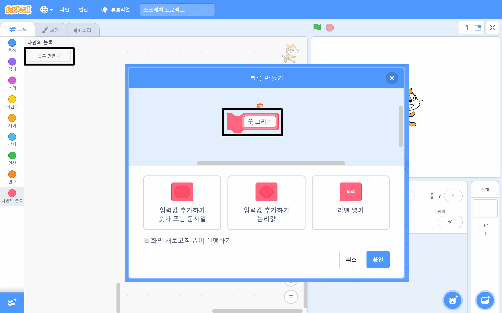

## 꽃을 그리는 커스텀 블록 만들기

꽃을 많이 그리려면 어떻게 해야 할까요? 코드를 여러 번 복사/붙여넣기 하는 대신 스크래치에서 자신 만의 블록을 만들고 꽃을 그릴 때마다 사용해봅시다.

--- task ---

**나만의 블록**을 클릭한 뒤 **블록 만들기**를 클릭하여 '꽃 그리기'라는 이름의 블럭을 만들어줍니다.



--- /task ---

--- task ---

이제 **나만의 블록** 영역에 `꽃 그리기`{:class="block3myblocks"}라는 블록이 추가되었는데요, 이제 이 블록에 대한 정의하기 블록을 무대에 추가합니다.

```blocks3
꽃 그리기 :: custom

define 꽃 그리기
```

--- /task ---

--- task ---

꽃을 그리기 위한 코드를 `녹색 깃발을 클릭했을 때`{:class="block3events"} 블록 아래에서 `꽃 그리기`{:class="block3myblocks"} 정의하기 블록 아래로 옮겨줍니다.

다음과 같은 코드가 될 것입니다:


```blocks3
define 꽃 그리기
repeat (6) 
  stamp
  turn cw (60) degrees
end

when green flag clicked
```

--- /task ---

--- task ---

다음 코드를 추가하여 녹색 깃발을 클릭했을 때 스테이지를 비우고 새로 만든 `꽃 그리기`{:class="block3myblocks"} 블록을 사용할 수 있게 합니다.


```blocks3
when green flag clicked
erase all
꽃 그리기 :: custom
```

--- /task ---

--- task ---

녹색 깃발을 클릭하여 코드를 테스트하고 꽃이 보이는지 확인하세요.

--- /task ---

--- task ---

이제 코드를 변경하여 스프라이트의 위치를 이동시킨 다음 다른 꽃을 그리게 합니다:


```blocks3
when green flag clicked
erase all
go to x: (75) y: (75)
꽃 그리기 :: custom
go to x: (-75) y: (-75)
꽃 그리기 :: custom 
```

--- /task ---

--- task ---

코드를 테스트하여 이번에는 두 개의 꽃이 보이는지 확인하세요.


--- /task ---