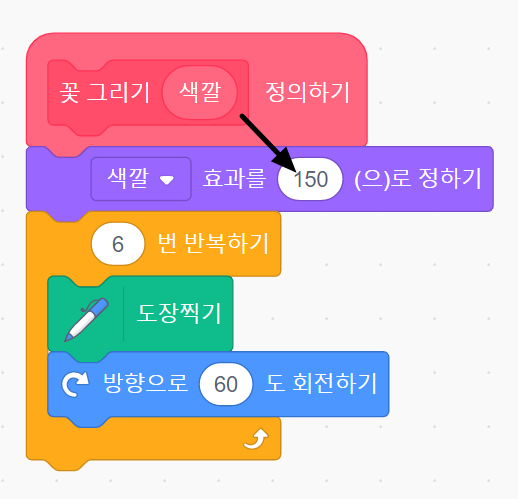
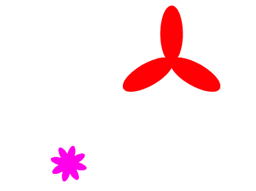

## 꽃 모양 바꾸기

지금 그리고 있는 모든 꽃은 모두 똑같은 크기와 모양을 가지고 있을 것입니다. 다음으로 `꽃 그리기`{:class="block3myblocks"} 블록에 입력을 추가하여 서로 다른 색깔, 크기, 꽃잎 개수를 가진 꽃을 그릴 수 있게 할 것입니다.

\--- task \---

스크래치에서는 `색깔 효과 정하기`{:class="block3looks"} 블록을 이용하여 스프라이트의 색깔을 바꿀 수 있습니다.

'꽃 그리기'의 정의를 바꾸어 색깔을 바꿔보세요:


```blocks3
define draw flower
set [color v] effect to (150)
repeat (6) 
  stamp
  turn cw (60) degrees
end
```

\--- /task \---

\--- task \---

코드를 실행하여 서로 다른 색깔의 꽃이 그려졌는지 확인하세요.


`색깔 효과 정하기`{:class="block3looks"} 블록은 스프라이트의 기본 색깔을 기준으로 색깔을 바꾸기 때문에, 만일 스프라이트가 주황색으로 시작하지 않으면 서로 다른 결과를 얻게 됩니다.

\--- /task \---

\--- task \---

`색깔 효과 정하기`{:class="block3looks"} 블록에서 `0`과 `199` 사이의 숫자로 바꿔보면서 결과가 어떻게 나타나는지 직접 확인해보세요.

\--- /task \---

현재 모든 꽃은 같은 색입니다. 각 꽃에 다른 색을 부여하려면 `꽃 그리기`{:class="block3myblocks"} 블록에 **입력**을 추가해야 합니다.

\--- task \---

`꽃 그리기`{:class="block3myblocks"} 정의하기 블록을 우클릭하고 **편집**을 클릭합니다:


\--- /task \---

\--- task \---

'색깔'이라는 이름의 **입력 값**을 추가하세요:


`꽃 그리기`{:class="block3myblocks"} 정의하기 블록에서 입력이 나타날 것인데, 이 입력을 드래그하여 사용하고 싶은 어디에든 변수로서 사용할 수 있습니다.

\--- /task \---

\--- task \---

'색깔' 입력 정보를 `색깔 효과 정하기`{:class="block3looks"} 블록으로 드래그합니다:



다음과 같은 코드가 될 것입니다:


```blocks3
define draw flower (colour)
set [color v] effect to (colour :: custom-arg)
repeat (6)
  stamp
  turn cw (60) degrees
end
```

\--- /task \---

`꽃 그리기`{:class="block3myblocks"} 블록들이 이제 `1`로 설정되어 있는 입력을 가지고 있을 것입니다:

```blocks3
when green flag clicked
erase all
go to x: (75) y: (75)
draw flower (1) :: custom
go to x: (-75) y: (-75)
draw flower (1) :: custom
```

\--- task \---

`꽃 그리기`{:class="block3myblocks"} 블럭의 숫자를 바꿔서 두 꽃이 서로 다른 색깔을 가지게 설정해보세요. 0에서 200 사이의 숫자를 선택할 수 있습니다.

다음과 같은 코드가 될 것입니다:


```blocks3
when green flag clicked
erase all
go to x: (75) y: (75)
draw flower (180) :: custom
go to x: (-75) y: (-75)
draw flower (150) :: custom
```

\--- /task \---

\--- task \---

이제 꽃의 크기를 설정하기 위한 입력을 추가하여 `꽃 그리기`{:class="block3myblocks"} 블록이 아래와 같이 보이게 바꿔주세요:


```blocks3
draw flower (180) (150) :: custom
```

위의 블록을 사용하면 크기가 다른 꽃을 만들 수 있습니다:


\--- hints \---

\--- hint \---

`색깔` 입력을 추가하는 과정을 떠올리면서 꽃의 크기를 조절할 수 있는 '크기' 입력을 추가해봅시다.

\--- /hint \---

\--- hint \---

`꽃 그리기`{:class="block3myblocks"} 블럭을 수정하여 '크기'라는 이름의 새로운 숫자 입력을 추가합니다:

`꽃 그리기`{:class="block3myblocks"} 정의 블록에 '크기' 입력을 가진 다음 블럭을 추가해야 합니다:

```blocks3
set size to (100) %
```

\--- /hint \---

\--- hint \---

`꽃 그리기`{:class="block3myblocks"} 정의 블록을 우클릭한 다음, **편집**을 클릭한 뒤 '크기'라는 이름의 숫자 입력을 추가합니다:


`꽃 그리기 정의하기`{:class="block3myblocks"} 스크립트를 아래와 같이 편집합니다:

```blocks3
define draw flower (colour) (size :: custom-arg)
set [color v] effect to (colour :: custom-arg)
set size to (size :: custom-arg) %
repeat (6) 
  stamp
  turn cw (60) degrees
end
```

\--- /hint \---

\--- /hints \---

\--- /task \--- \--- task \---

`녹색 깃발을 클릭했을 때`{:class="block3events"} 아래의 스크립트에서, 두 개의 `꽃 그리기` 블록을 모두 바꿔서 두 개의 꽃이 서로 다른 크기로 나타나게 합니다.

```blocks3
when green flag clicked
erase all
go to x: (75) y: (75)
draw flower (180) (150) :: custom
go to x: (-75) y: (-75)
draw flower (150) (50) :: custom
```

\--- /task \---

\--- task \---

코드를 테스트하여 꽃의 크기가 다른지 확인하세요.

\--- /task \---

\--- task \---

꽃이 가진 꽃잎의 수를 선택할 수 있다면 더 재미있을 것입니다.

다음과 같이 꽃을 그릴 수 있도록 다른 입력을 추가하세요:



\--- hints \--- \--- hint \---

'꽃잎' 숫자 입력을 추가 한 다음 `꽃 그리기 정의하기`{:class="block3myblocks"} 블록에서 추가한 입력을 사용해야 합니다.

'꽃잎' 입력을 추가해야 하는 두 곳이 있습니다.

꽃 스프라이트가 `회전`{:class="block3looks"}해야하는 각도는 `360`를 꽃잎의 개수로 나눈 값입니다.

\--- /hint \---

\--- hint \---

`꽃 그리기 정의하기`{:class="block3myblocks"} 스크립트를 아래와 같이 편집합니다:


```blocks3
define draw flower (colour) (size :: custom-arg) (petals)
```

`반복하기`{:class="block3control"}와 `회전하기`{:class="block3looks"} 블록이 '꽃잎' 변수를 사용하게 편집합니다.

```blocks3
repeat (petals :: custom-arg) 
end

turn cw ((360) / (petals :: custom-arg)) degrees
```

`꽃 그리기`{:class="block3myblocks"} 블록이 '꽃잎' 입력을 사용하게 편집합니다.

```blocks3
draw flower (150) (50) (8) :: custom
```

\--- /hint \---

\--- hint \---

`꽃 그리기 정의하기`{:class="block3myblocks"} 블록을 수정하여 '꽃잎' 변수를 추가합니다.


Your code should look like this:

```blocks3
define draw flower (colour) (size :: custom-arg) (petals)
set [color v] effect to (colour :: custom-arg)
set size to (size :: custom-arg) %
repeat (petals :: custom-arg) 
  stamp
  turn cw ((360) / (petals :: custom-arg)) degrees
end

```

In the `when green flag clicked`{:class="block3events"} script, change the third number in both `draw flower`{:class="block3myblocks"} blocks so that the two flowers that appear have different numbers of petals.

```blocks3
when green flag clicked
erase all
go to x: (75) y: (75)
draw flower (180) (150) (3) :: custom
go to x: (-75) y: (-75)
draw flower (150) (50) (8) :: custom
```

\--- /hint \---

\--- /hints \---

\--- /task \---

Next, edit your code so you can draw different flowers by pressing the <kbd>f</kbd> key.

\--- task \---

Now move your code for drawing flowers away from below the `when green flag clicked`{:class="block3events"} block, and put the code under a `when f key pressed`{:class="block3events"} block.


```blocks3
when green flag clicked
```

```blocks3
when [f v] key pressed
erase all
go to x: (75) y: (75)
draw flower (180) (150) (3) :: custom
go to x: (-75) y: (-75)
draw flower (150) (50) (8) :: custom
```

\--- /task \---

\--- task \---

Press <kbd>f</kbd> to test your code.

\--- /task \---

\--- task \---

Add more `draw flower`{:class="block3myblocks"} blocks to your program to draw flowers with different colours, sizes, and numbers of petals all over the Stage.

\--- /task \---