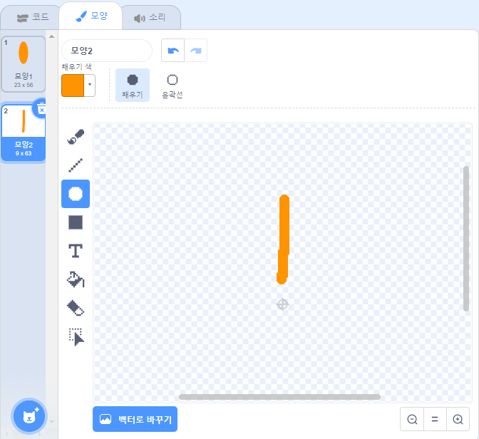

## Challenge: create a flower design

Can you use your `draw flower`{:class="block3myblocks"} block several times to draw more flowers and create an interesting design? Drawing different flowers at the same location creates an interesting effect.

Create a design that you like. 아래 예제를 참고하세요:

You don't have to use petals shaped like ellipses. For example, you can use thick straight lines and a black backdrop to create a firework pattern like this:

The 'petal' for the firework pattern is just a line:

Add new petal costumes and see what flowers you can come up with.

Try out a sprite shape that is not filled in, such as a square, and see what happens

