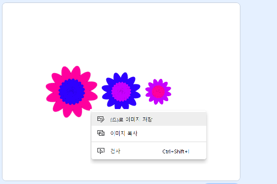

## 이미지 저장하기

원하는 이미지를 만들면 이미지를 저장하여 다른 스크래치 프로젝트, 화면 보호기 또는 웹 사이트에서 사용할 수 있습니다.

\--- task \---

스테이지에 원하는 이미지가 있으면 마우스 오른쪽 버튼으로 클릭하고 **다른 이름으로 이미지 저장**을 클릭합니다.

**참고:** 일부 컴퓨터 또는 브라우저에서는 이미지 저장을 위한 메뉴 이름이 다를 수 있습니다.

그런 다음 스테이지를 PNG 이미지로 저장할 수 있습니다.

\--- /task \---