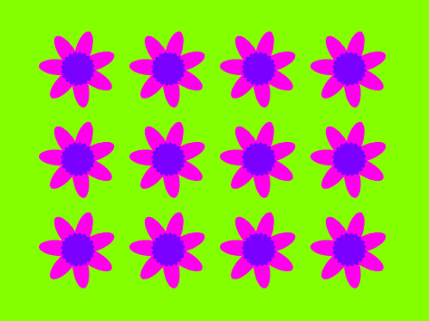

## 꽃 패턴 그리기

`꽃 그리기`{:class="block3myblocks"} 블록을 사용하여 근사한 꽃 패턴을 만들 수도 있습니다.

\--- task \---

꽃이나 원하는 꽃의 조합을 만들어봅시다. 아래 예제를 참고하세요:


```blocks3
when [p v] key pressed
erase all
go to x: (-150) y: (100)
draw flower (150) (80) (7) :: custom
draw flower (130) (35) (20) :: custom
```

\--- /task \---

\--- task \---

<kbd>p</kbd>를 눌러 꽃을 확인하세요. 그러면 다음과 같이 보일 것입니다:


\--- /task \---

패턴을 만들려면 먼저 무대에서 남은 꽃을 지워야 합니다.

\--- task \---

펜 블록 영역에 있는 `모두 지우기` 블럭을 누릅니다.

```blocks3
erase all
```

\--- /task \---

\--- task \---

꽃 스프라이트를 마우스 오른쪽 버튼으로 클릭하고 `숨기기`{:class="block3looks"} 를 눌러 무대에 표시되지 않도록 합니다. (어디 있는지 확인해야 한다면 `보이기`{:class="block3looks"}를 눌러 스프라이트를 다시 보이게 할 수 있습니다.)

\--- /task \---

\--- task \---

이제 무대 상단에 꽃들의 행을 그립니다. 다음은 예제 코드입니다(숫자를 조정해야 할 수도 있습니다):


```blocks3
when [p v] key pressed
erase all
go to x: (-150) y: (100)
repeat (4) 
  draw flower (150) (80) (7) :: custom
  draw flower (130) (35) (20) :: custom
  change x by (100)
end
```

\--- /task \---

\--- task \---

`p` 키를 눌러 꽃을 확인하세요:


\--- /task \---

\--- task \---

더 많은 꽃 행을 만들려면 다른 반복을 추가하세요. 다음 예시는 `3번 반복하기`{:class="block3control"} 블록을 추가하여 3개의 행을 만듭니다:


```blocks3
when [p v] key pressed
erase all
go to x: (-150) y: (100)
repeat (3) 
  repeat (4) 
    draw flower (150) (80) (7) :: custom
    draw flower (130) (35) (20) :: custom
    change x by (100)
  end
  set x to (-150)
  change y by (-100)
end
```

\--- /task \---

\--- task \---

<kbd>p</kbd> 키를 눌러 꽃으로 된 격자를 확인하세요:


\--- /task \---

꽃 그리기 속도를 높이고 싶나요?

\--- task \---

Right-click on the `draw flower`{:class="block3myblocks"} definition block and then click on **edit**. Click on the **Run without screen refresh** box.


Now the flowers get drawn more quickly.

\--- /task \---

You can also change the colour of the Stage.

\--- task \---

Click on **Choose a backdrop**, and then click on **Paint**. Create an orange backdrop by using the Fill tool in Bitmap mode.


If you use orange for the backdrop and the Flower sprite, then the numbers for different colours will match for the sprite and the backdrop.

\--- /task \---

\--- task \---

Now you can use the `set colour effect`{:class="block3looks"} on the Stage to change the colour of the backdrop.


```blocks3
when [p v] key pressed
set [color v] effect to (30)
```

\--- /task \---

\--- task \---

Try to create a pattern you like.

Here's an example:



\--- /task \---

When you put it all together, you can create an amazing effect:

