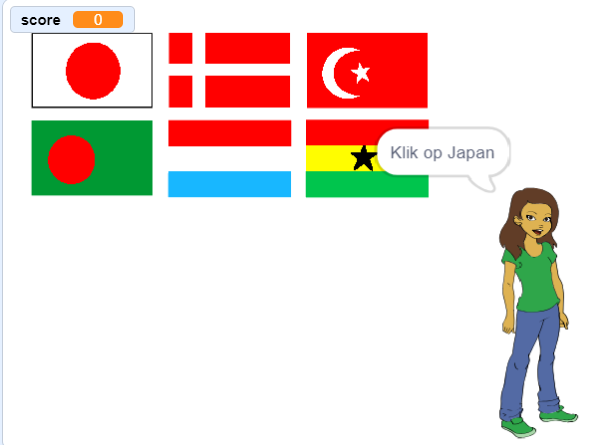

## Wat kun je verder nog doen?

Probeer ons project [Raad de vlag](https://projects.raspberrypi.org/nl-NL/projects/guess-the-flag?utm_source=pathway&utm_medium=whatnext&utm_campaign=projects), waar je een vlagquiz kunt maken om jezelf en je vrienden te testen.

--- no-print ---

Klik op de vlag van het land waarnaar gevraagd wordt.

  <iframe allowtransparency="true" width="485" height="402" src="https://scratch.mit.edu/projects/embed/276891625/?autostart=false" frameborder="0" scrolling="no"></iframe>

--- /no-print ---

--- print-only ---

--- /print-only ---

***
Dit project werd vertaald door vrijwilligers:

Sanneke van der Meer

Robert-Jan Kempenaar

Dankzij vrijwilligers kunnen we mensen over de hele wereld de kans geven om in hun eigen taal te leren. Jij kunt ons helpen meer mensen te bereiken door vrijwillig te starten met vertalen - meer informatie op [rpf.io/translate](https://rpf.io/translate).