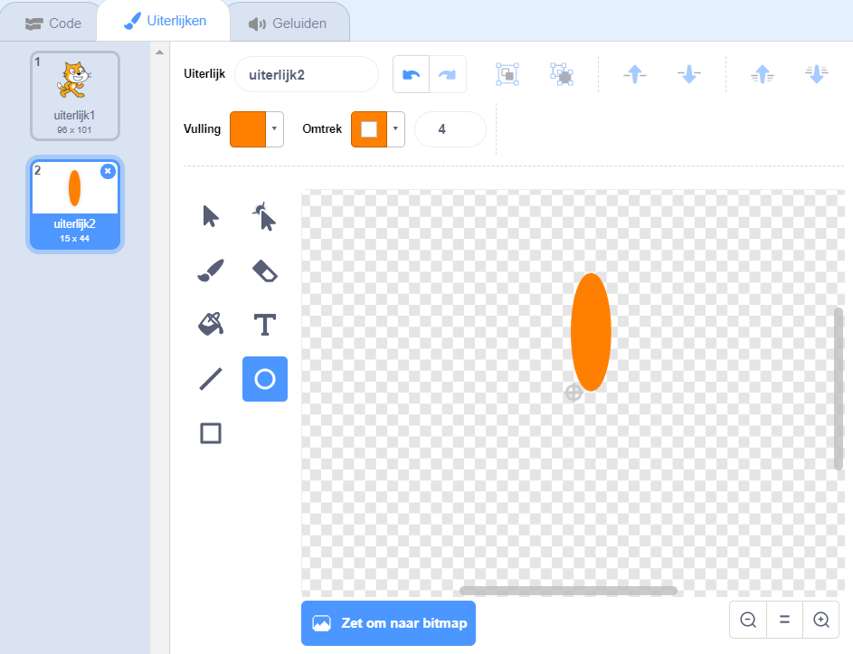
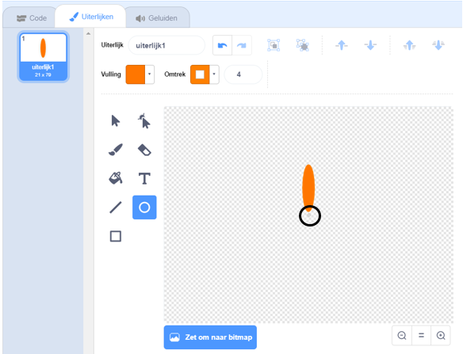

## Maak een bloem

Eerst ga je een bloem maken die in het speelveld kan worden getekend.

\--- task \---

Maak een nieuw Scratch project en verwijder de kat sprite.

[[[generic-scratch3-new-project]]]

\--- /task \---

\--- task \---

Voeg de Pen uitbreiding toe aan je project.

[[[generic-scratch3-add-pen-extension]]]

\--- /task \---

\--- task \---

Gebruik nu het teken hulpmiddel om een nieuwe sprite in de vorm van een bloemblad te maken.

Klik op **Kies een sprite**, klik vervolgens op **Teken** en hernoem de sprite 'Bloem'.

[[[generic-scratch3-draw-sprite]]]

\--- /task \---

\--- task \---

Gebruik het gereedschap Cirkel om een blaadje te tekenen dat helemaal oranje is.



Later ga je code gebruiken om meer kleur toe te voegen.

\--- /task \---

\--- task \---

Voeg de volgende code toe aan de Bloem sprite: `stempel`{:class="block3extensions"} een bloem met zes evenredig geroteerde blaadjes `wanneer op de groene vlag wordt geklikt`{:class="block3control"}.


```blocks3
wanneer op de groene vlag wordt geklikt
herhaal (6) 
  stempel
  draai (60) graden naar rechts
einde
```

\--- /task \---

Het kan zijn dat je blaadjes op een vreemde manier zijn gerangschikt:


Dit komt omdat de sprite rond het midden wordt gedraaid.

\--- task \---

Verplaats je blaadje zodat de onderkant in het midden staat.



Dit kan makkelijker te doen zijn als je uitzoomt.

\--- /task \---

Voordat je de code opnieuw uitvoert, moet je een `wis alles`{:class="block3extensions"} blok aan de sprites in het speelveld toevoegen.

\--- task \---

Klik op het `wis alles` blok in het gedeelte Pen.

```blocks3
wis alles
```

\--- /task \---

\--- task \---

Voer de code opnieuw uit om te controleren of de blaadjes recht zijn.


Als dit niet het geval is, pas je de positie van het blaadje aan tot de onderkant in het midden staat.

\--- /task \---