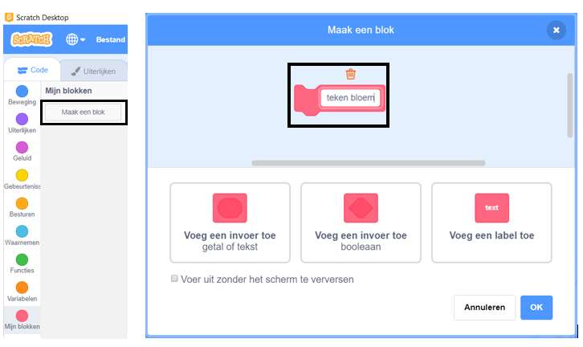

## Maak een aangepast blok om bloemen te tekenen

Wat als je veel bloemen wilt tekenen? In plaats van veel kopieën van de code te maken, maak je je eigen blok in Scratch en gebruik je dit elke keer dat je een bloem wilt tekenen.

\--- task \---

Klik op **Mijn blokken** en vervolgens op **Maak een blok** om je eigen blok te maken met de naam 'teken bloem'.



\--- /task \---

\--- task \---

Er is nu een nieuw blok met de naam `teken bloem`{:class="block3myblocks"} in de sectie **Mijn blokken** en een nieuw definitieblok in het spelveld.

```blocks3
teken bloem :: custom

definieer teken bloem
```

\--- /task \---

\--- task \---

Verplaats je code voor het tekenen van de bloem van het `wanneer op de groene vlag wordt geklikt`{:class="block3events"} blok naar het nieuwe `teken bloem`{:class="block3myblocks"} definitieblok.

Je code zou er als volgt uit moeten zien:


```blocks3
definieer teken bloem
herhaal (6) 
  stempel
  draai (60) graden naar rechts
einde

wanneer op de groene vlag wordt geklikt
```

\--- /task \---

\--- task \---

Voeg de volgende code toe om het speelveld te wissen en je nieuwe `teken bloem`{:class "block3myblocks"} blok te gebruiken wanneer op de groene vlag wordt geklikt:


```blocks3
wanneer op de groene vlag wordt geklikt
wis alles
teken bloem :: custom
```

\--- /task \---

\--- task \---

Klik op de groene vlag om je code te testen en controleer of je een bloem ziet.

\--- /task \---

\--- task \---

Wijzig nu je code om de sprite te verplaatsen en vervolgens een andere bloem te tekenen:


```blocks3
wanneer op de groene vlag wordt geklikt
wis alles
ga naar x: (75) y: (75)
teken bloem :: custom
ga naar x: (-75) y: (-75)
teken bloem :: custom 
```

\--- /task \---

\--- task \---

Test je code om te controleren of je nu twee bloemen ziet.


\--- /task \---