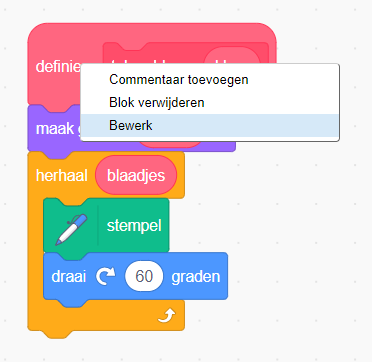
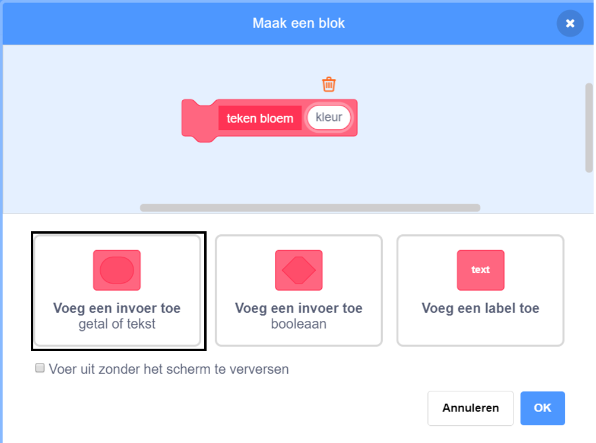
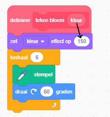

## Personaliseer je bloemen

Op dit moment zijn alle bloemen die je tekent precies hetzelfde. Nu ga je enkele invoervelden toevoegen aan het `teken bloem`{:class="block3myblocks"} blok zodat je bloemen kunt tekenen met verschillende kleuren, maten en aantallen blaadjes.

\--- task \---

In Scratch kun je het blok `zet kleur effect`{:class="block3looks"} gebruiken om de kleur van een sprite te wijzigen.

Wijzig je 'teken bloem' definitie om de kleur te wijzigen:


```blocks3
definieer teken bloem
zet [kleur v] effect op (150)
herhaal (6) 
  stempel
  draai (60) graden naar rechts
einde
```

\--- /task \---

\--- task \---

Voer je code uit om bloemen van verschillende kleuren te zien.


`zet kleur effect`{:class="block3looks"} wijzigt de kleur op basis van de standaardkleur van de sprite, dus als je sprite niet oranje begint, krijg je verschillende resultaten.

\--- /task \---

\--- task \---

Experimenteer met het gebruik van verschillende getallen van `0` tot `199` in het `zet kleur effect`{:class="block3looks"} en bekijk welke verschillende resultaten je krijgt.

\--- /task \---

Op dit moment hebben alle bloemen dezelfde kleur. Om elke bloem een andere kleur te geven, moet je een **invoer** aan het `teken bloem`{:class="block3myblocks"} blok toevoegen.

\--- task \---

Klik met de rechtermuisknop op het definitieblok `teken bloem`{:class="block3myblocks"} en kies **bewerk**:



\--- /task \---

\--- task \---

Voeg nu een **invoer** toe met de naam 'kleur':



De invoer verschijnt in de definitie van `teken bloem`{:class="block3myblocks"} en je kunt deze naar de gewenste locatie slepen.

\--- /task \---

\--- task \---

Sleep de invoer 'kleur' naar het `zet kleur effect`{:class="block3looks"} blok:



Je code zou er als volgt uit moeten zien:


```blocks3
definieer teken bloem (kleur)
zet [kleur v] effect op (kleur :: custom-arg)
herhaal (6)
  stempel
  draai (60) graden naar rechts
einde
```

\--- /task \---

Merk op dat je `teken bloem`{:class="block3myblocks"} blokken nu een nieuwe invoer hebben die is ingesteld op `1`:

```blocks3
wanneer op de groene vlag wordt geklikt
wis alles
ga naar x: (75) y: (75)
teken bloem (1) :: custom
ga naar x: (-75) y: (-75)
teken bloem (1) :: custom
```

\--- task \---

Wijzig de getallen in de `teken bloem`{:class="block3myblocks"} blokken zodat de twee bloemen in verschillende kleuren verschijnen. Je kunt elk nummer tussen 0 en 200 kiezen.

Je code zou er ongeveer zo uit moeten zien:


```blocks3
wanneer op de groene vlag wordt geklikt
wis alles
ga naar x: (75) y: (75)
teken bloem (180) :: custom
ga naar x: (-75) y: (-75)
teken bloem (150) :: custom
```

\--- /task \---

\--- task \---

Voeg nu een andere invoer toe om de grootte van de bloem in te stellen, zodat je `teken bloem`{:class="block3myblocks"} blok er zo uitziet:


```blocks3
teken bloem (180) (150) :: custom
```

Met het bovenstaande blok kun je bloemen met verschillende maten maken:


\--- hints \---

\--- hint \---

Kijk wat je hebt gedaan om de `kleur` invoer toe te voegen en herhaal dit om een 'grootte'-invoer toe te voegen die je kunt gebruiken om de grootte van de bloem sprite in te stellen.

\--- /hint \---

\--- hint \---

Bewerk het blok `teken bloem`{:class="block3myblocks"} om een nieuwe invoer 'grootte' toe te voegen.

Je moet het volgende blok met een 'grootte' invoer toevoegen aan het definitieblok `teken bloem`{:class="block3myblocks"}:

```blocks3
maak grootte (100) %
```

\--- /hint \---

\--- hint \---

Klik met de rechtermuisknop op het definitieblok `teken bloem`{:class="block3myblocks"}, klik op **bewerk**en voeg een invoer toe met de naam 'grootte'.


Verander je `definieer teken bloem`{:class="block3myblocks"} script zodat het er zo uitziet:

```blocks3
definieer teken bloem (kleur) (grootte :: custom-arg)
zet [kleur v] effect op (kleur :: custom-arg)
maak grootte (maat :: custom-arg) %
herhaal (6) 
  stempel
  draai (60) graden naar rechts
einde
```

\--- /hint \---

\--- /hints \---

\--- /task \--- \--- task \---

In het `wanneer op de groene vlag wordt geklikt`{:class="block3events"} script, wijzig je het tweede getal in beide `teken bloem`{:class="block3myblocks"} blokken zodat de twee bloemen in verschillende formaten verschijnen.

```blocks3
wanneer op de groene vlag wordt geklikt
wis alles
ga naar x: (75) y: (75)
teken bloem (180) (150) :: custom
ga naar x: (-75) y: (-75)
teken bloem (150) (50) :: custom
```

\--- /task \---

\--- task \---

Test je code om te controleren of de bloemen verschillende maten hebben.

\--- /task \---

\--- task \---

Het zou cool zijn om het aantal blaadjes te kiezen dat de bloemen hebben.

Voeg nog een invoer toe zodat je bloemen als volgt kunt tekenen:


\--- hints \--- \--- hint \---

Je moet een 'blaadjes' invoer toevoegen en deze vervolgens gebruiken in het blok `definieer teken bloem`{:class="block3myblocks"}.

Er zijn twee plaatsen waar je de invoer 'blaadjes' moet toevoegen.

Het aantal graden waarmee de bloem sprite `moet draaien`{:class="block3looks"} is `360` gedeeld door het aantal blaadjes.

\--- /hint \---

\--- hint \---

Wijzig je `definieer teken bloem`{:class="block3myblocks"} blok zodat het er zo uit ziet:


```blocks3
definieer teken bloem (kleur) (grootte :: custom-arg) (blaadjes)
```

Pas je `herhaal`{:class="block3control"} en `draai`{:class="block3looks"} blokken aan zodat ze de invoer 'blaadjes' gebruiken.

```blocks3
herhaal (blaadjes :: custom-arg) 
einde

draai ((360) / (blaadjes :: custom-arg)) graden naar rechts
```

Update je `teken bloem`{:class="block3myblocks"} blokken om de invoer 'blaadjes' te gebruiken.

```blocks3
teken bloem (150) (50) (8) :: custom
```

\--- /hint \---

\--- hint \---

Bewerk je `definieer teken bloem`{:class="block3myblocks"} blok en voeg een nieuwe invoer toe met de naam 'blaadjes'.


Je code zou er als volgt uit moeten zien:

```blocks3
definieer teken bloem (kleur) (grootte :: custom-arg) (blaadjes)
zet [kleur v] effect op (kleur :: custom-arg)
maak grootte (grootte :: custom-arg) %
herhaal (blaadjes :: custom-arg) 
  stempel
  draai ((360) / (blaadjes :: custom-arg)) graden naar rechts
einde

```

In het `wanneer op de groene vlag wordt geklikt`{:class="block3events"} script, wijzig je het derde getal in beide `teken bloem`{:class="block3myblocks"} blokken zodat de twee bloemen die verschijnen verschillende aantallen blaadjes hebben.

```blocks3
wanneer op de groene vlag wordt geklikt
wis alles
ga naar x: (75) y: (75)
teken bloem (180) (150) (3) :: custom
ga naar x: (-75) y: (-75)
teken bloem (150) (50) (8) :: custom
```

\--- /hint \---

\--- /hints \---

\--- /task \---

Bewerk vervolgens je code zodat je verschillende bloemen kunt tekenen door op de toets <kbd>f</kbd> te drukken.

\--- task \---

Haal nu je code voor het tekenen van bloemen weg onder het `wanneer op de groene vlag wordt geklikt`{:class="block3events"} blok en plaats de code onder een `wanneer f is ingedrukt`{:class="block3events"} blok.


```blocks3
wanneer op de groene vlag wordt geklikt
```

```blocks3
wanneer [f v] is ingedrukt
wis alles
ga naar x: (75) y: (75)
teken bloem (180) (150) (3) :: custom
ga naar x: (-75) y: (- 75)
teken bloem (150) (50) (8) :: custom
```

\--- /task \---

\--- task \---

Druk op <kbd>f</kbd> om je code te testen.

\--- /task \---

\--- task \---

Voeg meer `teken bloem`{:class="block3myblocks"} blokken toe aan je programma om bloemen met verschillende kleuren, maten en aantallen blaadjes over het hele speelveld te tekenen.

\--- /task \---