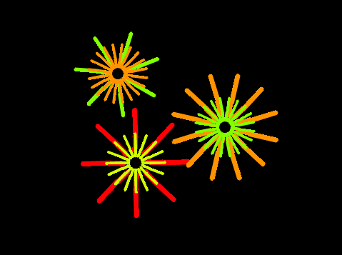
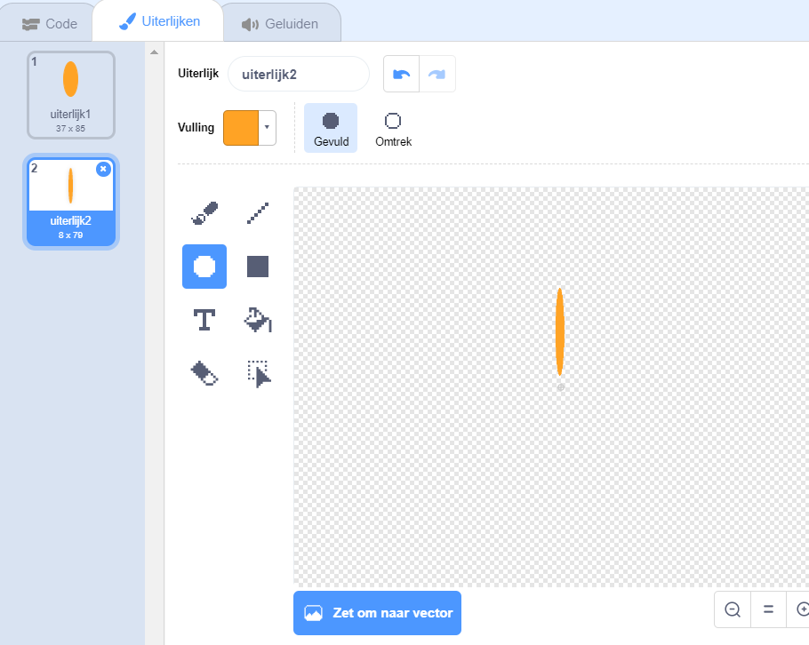
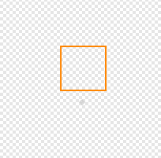

## Uitdaging: maak een bloemontwerp

Kun je je `teken bloem`{:class="block3myblocks"} blok meerdere keren gebruiken om meer bloemen te tekenen en een interessant ontwerp te maken? Het tekenen van verschillende bloemen op dezelfde locatie creëert een interessant effect.

Maak een ontwerp dat je leuk vindt. Hier is een voorbeeld:

Je hoeft geen blaadjes in de vorm van ellipsen te gebruiken. Je kunt bijvoorbeeld dikke rechte lijnen en een zwarte achtergrond gebruiken om een vuurwerkpatroon te maken:

Het 'blaadje' voor het vuurwerkpatroon is slechts een lijn:

Voeg nieuwe blaadjes uiterlijken toe en kijk welke bloemen je kunt bedenken.

Probeer een sprite vorm uit die niet is ingevuld, zoals een vierkant, en kijk wat er gebeurt

