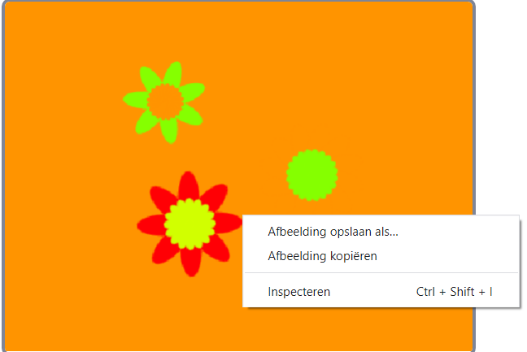

## Sla je afbeeldingen op

Wanneer je een afbeelding maakt die je leuk vindt, kun je deze opslaan en gebruiken in een ander Scratch project, als screensaver of op een website.

--- task ---

Wanneer er een afbeelding in het speelveld staat die je wilt bewaren, klik er met de rechtermuisknop op en klik vervolgens op **afbeelding opslaan als**

**Opmerking:** op sommige computers of browsers kan de menuoptie voor het opslaan van de afbeelding een andere naam hebben.

Vervolgens kun je een PNG-afbeelding van het speelveld opslaan.

--- /task ---