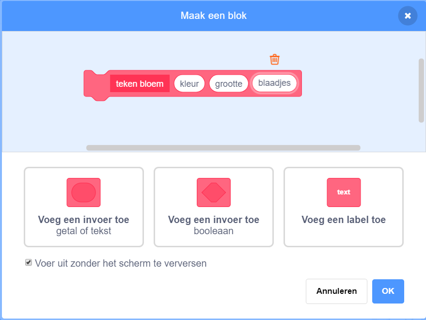
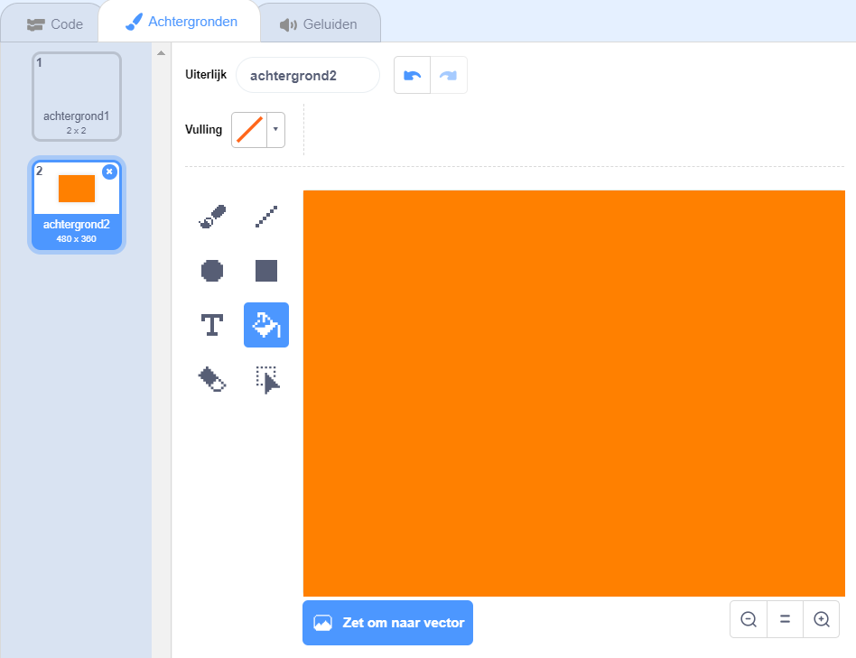

## Bloem patronen

Je kunt je `teken bloem`{:class="block3myblocks"} blok ook gebruiken om nette bloempatronen te maken.

--- task ---

Maak een bloem of een combinatie van bloemen die je leuk vindt. Hier is een voorbeeld:


```blocks3
wanneer [p v] is ingedrukt
wis alles
ga naar x: (-150) y: (100)
teken bloem (150) (80) (7) :: custom
teken bloem (130) (35) (20) :: custom
```

--- /task ---

--- task ---

Druk op <kbd>p</kbd> om je bloem te zien. Het voorbeeld ziet er zo uit:


--- /task ---

Voordat je een patroon kunt maken, moet je overgebleven bloemen verwijderen van het speelveld.

--- task ---

Klik op het blok `wis alles` in het tabblad Pen.

```blocks3
wis alles
```

--- /task ---

--- task ---

Klik met de rechtermuisknop op de bloem sprite en `verdwijn`{:class="block3looks"} zodat deze niet in het speelveld verschijnt. (Je kunt de sprite opnieuw `laten verschijnen`{:class="block3looks"} als je wilt zien waar het is.)

--- /task ---

--- task ---

Teken nu een rij van deze bloemen aan de bovenkant van het speelveld. Hier is wat voorbeeldcode, waarin je mogelijk de getallen moet aanpassen zodat deze werkt met jouw bloem:


```blocks3
wanneer [p v] is ingedrukt
wis alles
ga naar x: (-150) y: (100)
herhaal (4) 
  teken bloem (150) (80) (7) :: custom
  teken bloem (130) ( 35) (20) :: custom
  verander x met (100)
einde
```

--- /task ---

--- task ---

Druk op `p` om een rij bloemen te zien:


--- /task ---

--- task ---

Voeg nog een lus toe om meer rijen bloemen te maken. Dit voorbeeld voegt een `herhaal 3`{:class="block3control"} lus toe om drie rijen te maken.


```blocks3
wanneer [p v] is ingedrukt
wis alles
ga naar x: (-150) y: (100)
herhaal (3) 
  herhaal (4) 
    teken bloem (150) (80) (7) :: custom
    teken bloem (130) (35) (20) :: custom
    verander x met (100)
  einde
  maak x (-150)
  verander y met (-100)
einde
```

--- /task ---

--- task ---

Druk op <kbd>p</kbd> om een bloemenraster te maken:


--- /task ---

Wil je dat de bloemen sneller getekend worden?

--- task ---

Klik met de rechtermuisknop op het definitieblok `teken bloem`{:class="block3myblocks"} en klik vervolgens op **bewerken**. Klik op het vak **Voer uit zonder het scherm te verversen**.



Nu worden de bloemen sneller getekend.

--- /task ---

Je kunt ook de kleur van het speelveld veranderen.

--- task ---

Klik op **Kies een achtergrond**en klik vervolgens op **Tekenen**. Maak een oranje achtergrond met behulp van het hulpmiddel Vullen in de bitmapmodus.



Als je oranje gebruikt voor de achtergrond en de bloem sprite, komen de nummers voor verschillende kleuren overeen voor de sprite en de achtergrond.

--- /task ---

--- task ---

Nu kun je het `zet kleur effect op`{:class="block3looks"} blok in het speelveld gebruiken om de kleur van de achtergrond te wijzigen.


```blocks3
wanneer [p v] is ingedrukt
set [kleur v] effect to (30)
```

--- /task ---

--- task ---

Probeer een patroon te maken dat je leuk vindt.

Hier is een voorbeeld:


--- /task ---

Als je alles samenvoegt, kun je een geweldig effect creëren:

