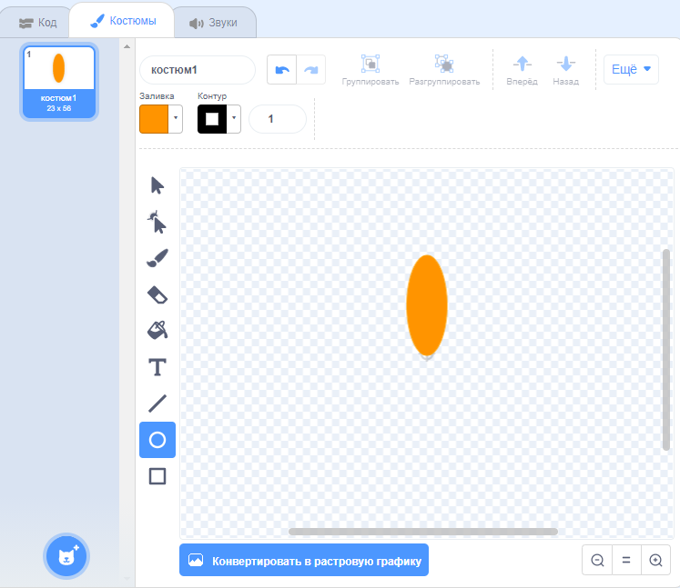
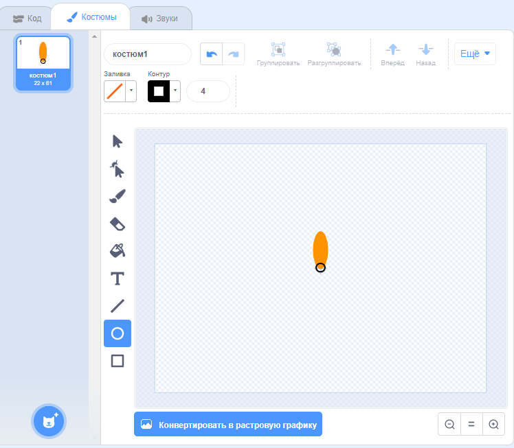

## Создание цветка

Сначала ты создашь цветок, который можно нарисовать на сцене.

\--- task \---

Создай новый проект Scratch и удали спрайт кота.

[[[generic-scratch3-new-project]]]

\--- /task \---

\--- task \---

Добавь расширение Перо в твой проект.

[[[generic-scratch3-add-pen-extension]]]

\--- /task \---

\--- task \---

Теперь воспользуемся инструментом Нарисовать, чтобы создать новый спрайт-лепесток цветка.

Нажми на **Выбрать спрайт**, затем нажми **Нарисовать** и переименуй спрайт в «Цветок».

[[[generic-scratch3-draw-sprite]]]

\--- /task \---

\--- task \---

Используй инструмент Круг, чтобы нарисовать форму лепестка, залитого оранжевым цветом.



Позже ты добавишь больше цветов с помощью кода.

\--- /task \---

\--- task \---

Добавь следующий код к спрайту цветка, чтобы `напечатать`{:class="block3extensions"} цветок с шестью одинаково повернутыми лепестками `когда флаг нажат`{:class="block3control"}.


```blocks3
когда щёлкнут по зелёному флагу
повторить (6) раз 
  печать
  повернуть вправо на (60) градусов
end
```

\--- /task \---

Лепестки могут странно расположиться:


Это потому, что спрайт вращается вокруг своего центра.

\--- task \---

Перемести лепесток так, чтобы его основание было в центре.



Сделать это можно удобнее, уменьшив масштаб.

\--- /task \---

Перед повторным запуском кода ты должен `стереть все`{:class="block3extensions"} спрайты на Сцене.

\--- task \---

Нажми на блок `стереть всё` в разделе блоков Перо.

```blocks3
стереть всё
```

\--- /task \---

\--- task \---

Запусти свой код еще раз, чтобы проверить, что лепестки цветка расположены правильно.


Если нет, отрегулируй положение лепестка так, чтобы его основание было в центре.

\--- /task \---