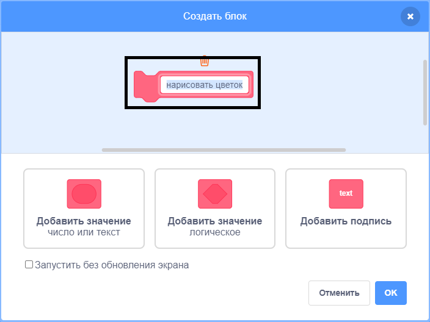

## Создай пользовательский блок, чтобы нарисовать цветы

Что делать, если ты хочешь нарисовать много цветов? Вместо того, чтобы делать много копий кода, создай свой собственный блок в Scratch и используй его каждый раз, когда хочешь нарисовать цветок.

--- task ---

Нажми на **Другие блоки**, а затем на **Создать блок**, чтобы создать свой собственный блок с именем «нарисовать цветок».



--- /task ---

--- task ---

Теперь появился новый блок с именем `нарисовать цветок`{:class="block3myblocks"} в разделе **Другие блоки** и новый блок определения на Сцене.

```blocks3
нарисовать цветок :: custom

определить нарисовать цветок
```

--- /task ---

--- task ---

Перемести свой код для рисования цветка из блока `когда зеленый флаг нажат`{:class="block3events"} в новый блок определения `нарисовать цветок`{:class="block3myblocks"}.

Твой код должен выглядеть вот так:


```blocks3
определить нарисовать цветок
повторить (6) раз 
  печать
  повернуть вправо на (60) градусов
end

когда щёлкнут по зелёному флагу
```

--- /task ---

--- task ---

Добавь следующий код, чтобы очистить Сцену и использовать твой новый блок `нарисовать цветок`{:class="block3myblocks"} при нажатии на зеленый флаг:


```blocks3
когда щёлкнут по зелёному флагу
стереть всё
нарисовать цветок :: custom
```

--- /task ---

--- task ---

Нажми на зеленый флаг, чтобы проверить свой код и проверить, видишь ли ты цветок.

--- /task ---

--- task ---

Теперь измени код, чтобы переместить спрайт, а затем нарисуй еще один цветок:


```blocks3
когда щёлкнут по зелёному флагу
стереть всё
перейти в x: (75) y: (75)
нарисовать цветок :: custom
перейти в x: (-75) y: (-75)
нарисовать цветок :: custom 
```

--- /task ---

--- task ---

Проверь свой код, чтобы убедиться, что ты теперь видишь два цветка.


--- /task ---