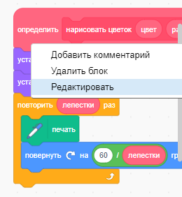
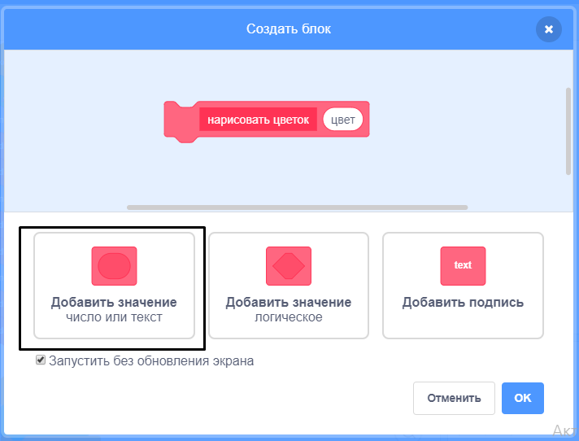
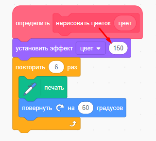

## Отредактируй цветы

На данный момент все цветы, которые ты рисуешь, абсолютно одинаковы. Далее ты добавишь некоторые входные данные для блока `нарисовать цветок`{:class="block3myblocks"}, благодаря чему ты сможешь рисовать цветы разных расцветок, размеров и с разным количеством лепестков.

--- task ---

В Scratch ты можешь использовать блок `установить цветовой эффект`{:class="block3looks"}, чтобы изменить цвет спрайта.

Измени определение блока «нарисовать цветок», чтобы изменить цвет:


```blocks3
определить нарисовать цветок
установить эффект [цвет v] в (150)
повторить (6) раз 
  печать
  повернуть вправо на (60) градусов
end
```

--- /task ---

--- task ---

Запусти свой код, чтобы увидеть цветы разных расцветок.


`установить эффект цвет`{:class="block3looks"} меняет цвет в зависимости от цвета спрайта по умолчанию, так что, если твой спрайт не оранжевого цвета изначально, ты получишь другие результаты.

--- /task ---

--- task ---

Поэкспериментируй с использованием разных чисел от `0` до `199` в блоке `установить эффект цвет`{:class="block3looks"} и понаблюдай за разными результатами.

--- /task ---

На данный момент все цветы одного цвета. Чтобы придать каждому цветку свой цвет, тебе нужно добавить **значение** к блоку `нарисовать цветок`{:class="block3myblocks"}.

--- task ---

Щелкни правой кнопкой мыши на блок определения `нарисовать цветок`{:class="block3myblocks"} и выбери **редактировать**:



--- /task ---

--- task ---

Теперь добавь **значение число** с именем "цвет":



Значение появляется в определении `нарисовать цветок`{:class="block3myblocks"}, и ты можешь перетащить его туда, где хочешь использовать.

--- /task ---

--- task ---

Перетащи значение "цвет" в блок `установить эффект цвет`{:class="block3looks"}:



Твой код должен выглядеть так:


```blocks3
определить нарисовать цветок (цвет)
установить эффект [цвет v] в (цвет :: custom-arg)
повторить (6) раз 
  печать
  повернуть вправо на (60) градусов
end
```

--- /task ---

Обрати внимание, что твои блоки `нарисовать цветок`{:class="block3myblocks"} теперь имеют новое значение, которое установлено в `1`:

```blocks3
когда щёлкнут по зелёному флагу
стереть всё
перейти в x: (75) y: (75)
нарисовать цветок (1) :: custom
перейти в x: (-75) y: (-75)
нарисовать цветок (1) :: custom
```

--- task ---

Измени числа в блоках `нарисовать цветок`{:class="block3myblocks"} так, чтобы два цветка были разных расцветок. Можно выбрать любые числа от 0 до 200.

У тебя должен получиться примерно такой код:


```blocks3
когда щёлкнут по зелёному флагу
стереть всё
перейти в x: (75) y: (75)
нарисовать цветок (180) :: custom
перейти в x: (-75) y: (-75)
нарисовать цветок (150) :: custom
```

--- /task ---

--- task ---

Теперь добавь еще одно значение, чтобы установить размер цветка так, чтобы твой блок `нарисовать цветок`{:class="block3myblocks"} выглядел следующим образом:


```blocks3
нарисовать цветок (180) (150) :: custom
```

С помощью блока выше ты можешь создавать цветы разных размеров:


--- hints ---


--- hint ---

Посмотри, как ты добавил значение `цвет` и повтори, добавив значение «размер», которое ты будешь использовать, чтобы установить размер спрайта Цветок.

--- /hint ---

--- hint ---

Отредактируй блок `нарисовать цветок`{:class="block3myblocks"} и добавь новое значение "размер".

Нужно добавить следующий блок со значением 'размер' к блоку определения `нарисовать цветок`{:class="block3myblocks"}:

```blocks3
установить размер (100) %
```

--- /hint ---

--- hint ---

Щелкни правой кнопкой мыши на блок определения `нарисовать цветок`{:class="block3myblocks"}, нажми **редактировать** и добавь числовое значение «размер».


Измени свой скрипт `определить нарисовать цветок`{:class="block3myblocks"}, чтобы он выглядел так:

```blocks3
определить нарисовать цветок (цвет) (размер :: custom-arg)
установить эффект [цвет v] в (цвет :: custom-arg)
установить размер (размер :: custom-arg) %
повторить (6) раз 
  печать
  повернуть вправо на (60) градусов
end
```

--- /hint ---

--- /hints ---

--- /task --- --- task ---

В скрипте `когда щёлкнут по зелёному флагу`{:class="block3events"} измени второе число в обоих блоках `нарисовать цветок`{:class="block3myblocks"} так, чтобы оба цветка были разных размеров.

```blocks3
когда щёлкнут по зелёному флагу
стереть всё
перейти в x: (75) y: (75)
нарисовать цветок (180) (150) :: custom
перейти в x: (-75) y: (-75)
нарисовать цветок (150) (50):: custom
```

--- /task ---

--- task ---

Протестируй свой код, чтобы проверить, разных ли размеров цветы.

--- /task ---

--- task ---

Было бы здорово выбрать количество лепестков у цветов.

Добавь еще одно значение, чтобы можно было рисовать цветы так:


--- hints ---
 --- hint ---

Тебе нужно добавить числовое значение 'лепестки', а затем использовать его в блоке `определить нарисовать цветок`{:class="block3myblocks"}.

Тебе нужно добавить значение «лепестки» в двух местах.

Количество градусов, на которые спрайт цветка должен `повернуться`{:class="block3looks"} `360` делится на количество лепестков.

--- /hint ---

--- hint ---

Измени свой блок `определить нарисовать цветок`{:class="block3myblocks"}, чтобы он выглядел так:


```blocks3
определить нарисовать цветок (цвет) (размер :: custom-arg) (лепестки)
```

Обнови блоки `повторить`{:class="block3control"} и `повернуть`{:class="block3looks"} так, чтобы они использовали значение 'лепестки'.

```blocks3
повторить (лепестки :: custom-arg) раз
end

повернуть вправо на ((360) / (лепестки :: custom-arg)) градусов
```

Обнови блоки `нарисовать цветок`{:class="block3control"}, чтобы они использовали значение 'лепестки'.

```blocks3
нарисовать цветок (150) (50) (8) :: custom
```

--- /hint ---

--- hint ---

Отредактируй блок `определить нарисовать цветок`{:class="block3myblocks"} и добавь новое числовое значение 'лепестки'.


Твой код должен выглядеть так:

```blocks3
определить нарисовать цветок (colour) (size :: custom-arg) (petals)
установить эффект [цвет v] в (цвет :: custom-arg)
установить размер (размер :: custom-arg) %
повторить (лепестки :: custom-arg) раз 
  печать
  повернуть вправо на ((360) / (лепестки :: custom-arg)) градусов
end

```

В скрипте `когда щёлкнут по зелёному флагу`{:class="block3events"} измени третье число в обоих блоках `нарисовать цветок`{:class="block3myblocks"} так, чтобы оба цветка имели разное количество лепестков.

```blocks3
когда щёлкнут по зелёному флагу
стереть всё
перейти в x: (75) y: (75)
нарисовать цветок (180) (150) (3):: custom
перейти в x: (-75) y: (-75)
нарисовать цветок (150) (50) (8) :: custom
```

--- /hint ---

--- /hints ---

--- /task ---

Затем отредактируй код, чтобы ты мог рисовать разные цветы, нажимая кнопку <kbd>f</kbd>.

--- task ---

Теперь перемести код для рисования цветов из-под блока `когда щёлкнут по зелёному флагу`{:class="block3events"} и помести его под блок `клавиша f нажата?`{:class = "block3events"}.


```blocks3
когда щёлкнут по зелёному флагу
```

```blocks3
когда клавиша [f v] нажата
стереть всё
перейти в x: (75) y: (75)
нарисовать цветок (180) (150) (3) :: custom 
перейти в x: (-75) y: (-75)
нарисовать цветок (150) (50) (8) :: custom
```

--- /task ---

--- task ---

Нажми клавишу <kbd>f</kbd>, чтобы проверить код.

--- /task ---

--- task ---

Добавь еще блоков `нарисовать цветок`{:class="block3myblocks"} в твою программу для рисования цветов разных расцветок, размеров и с разным количеством лепестков по всей Сцене.

--- /task ---