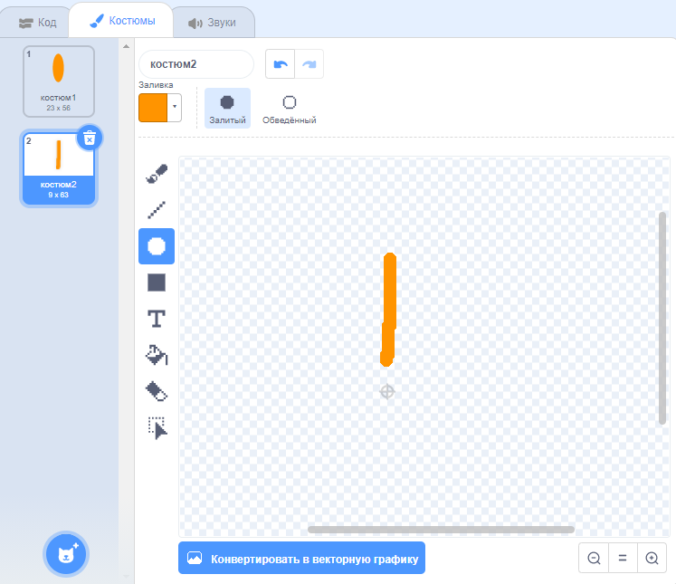
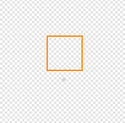

## Задача: создать цветочный рисунок

Можешь ли ты использовать свой блок `нарисовать цветок`{:class="block3myblocks"} несколько раз, чтобы нарисовать больше цветов и создать интересный рисунок? Нарисовав разные цветы в одном месте, можно создать интересный эффект.

Создай понравившийся тебе рисунок. Например:

Не обязательно использовать лепестки только в форме овала. Например, ты можешь использовать толстые прямые линии и черный фон, чтобы создать рисунок фейерверка, что-то вроде этого:

«Лепесток» для фейерверка - это просто линия:

Добавь новые костюмы лепестка и посмотри, какие получатся цветы.

Попробуйте фигуру спрайта, которая не закрашена, например квадрат, и посмотри, что произойдет

