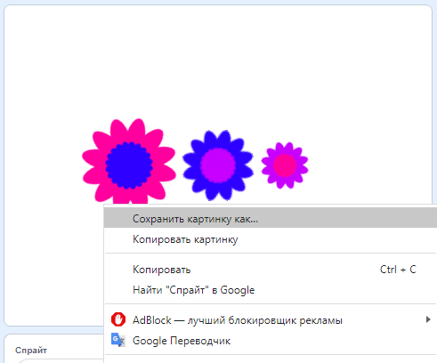

## Сохрани изображения

Если созданное изображение тебе понравилось, ты можешь сохранить его и использовать в другом проекте Scratch, на другом сайте или как заставку.

\--- task \---

Если изображение на Сцене тебе нравится, щелкни по нему правой кнопкой мыши, а затем нажми **сохранить изображение как**

**Примечание:** на некоторых компьютерах или браузерах меню для сохранения изображения может называться по-разному.

Затем ты можешь сохранить PNG-изображение Сцены.

\--- /task \---