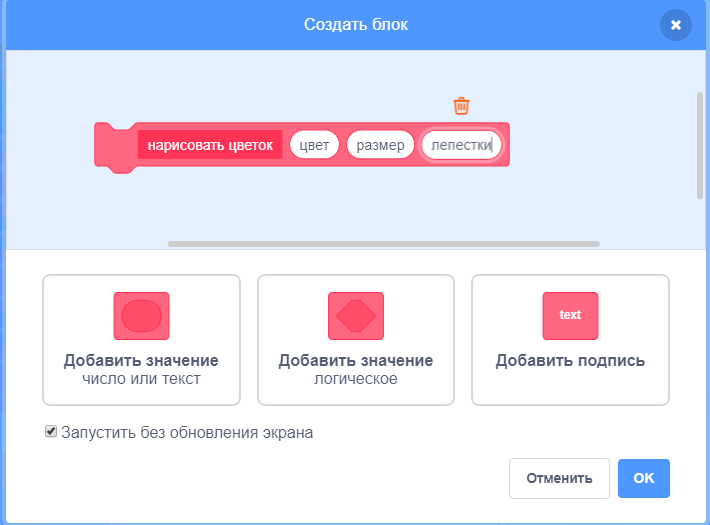
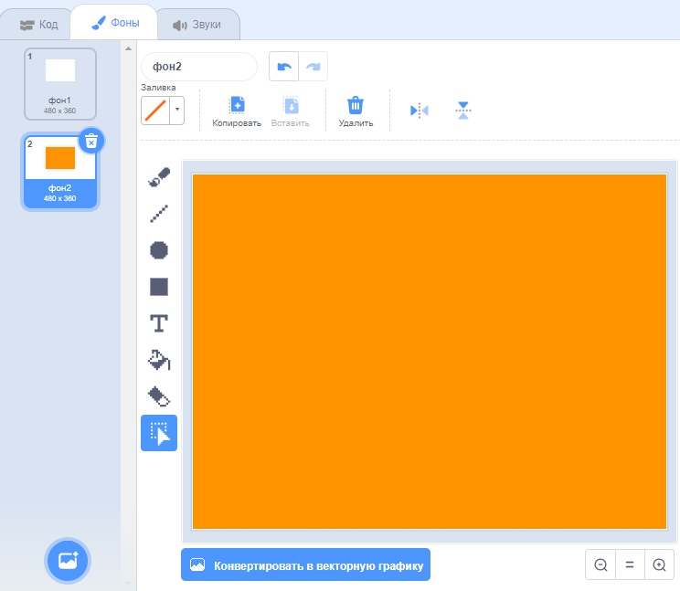
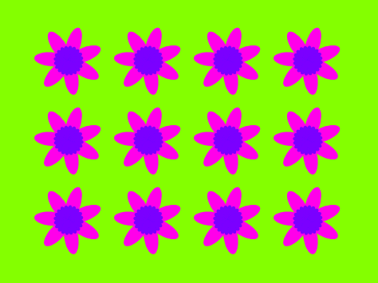

## Цветочные узоры

Ты также можешь использовать блок `нарисовать цветок`{:class="block3myblocks"}, чтобы создать красивые цветочные узоры.

--- task ---

Создай цветок или комбинацию цветов, которые тебе нравится. Например:


```blocks3
когда клавиша [p v] нажата
стереть всё
перейти в x: (-150) y: (100)
нарисовать цветок (150) (80) (7) :: custom 
нарисовать цветок (130) (35) (20) :: custom
```

--- /task ---

--- task ---

Нажми <kbd>r</kbd> чтобы увидеть цветок. Пример выглядит следующим образом:


--- /task ---

Прежде чем ты создашь свой узор, ты должен очистить Сцену от предыдущих цветов.

--- task ---

Нажми на блок `стереть все` в разделе блоков Перо.

```blocks3
стереть все
```

--- /task ---

--- task ---

Щелкни правой кнопкой мыши на спрайт Цветок и `скрой`{:class="block3looks"} его, чтобы он не появлялся на Сцене. (Ты можешь `показать`{:class="block3looks"} спрайт снова, если нужно посмотреть, где он находится.)

--- /task ---

--- task ---

Теперь нарисуй ряд этих цветов в верху Сцены. Вот пример кода, в котором тебе может понадобиться настроить числа так, чтобы они подходили вашему цветку:


```blocks3
когда клавиша [p v] нажата
стереть всё
перейти в x: (-150) y: (100)
повторить (4) раз
нарисовать цветок (150) (80) (7) :: custom
нарисовать цветок (130) (35) (20) :: custom
изменить x на (100)
end
```

--- /task ---

--- task ---

Нажми `p` чтобы увидеть ряд цветов:


--- /task ---

--- task ---

Добавь еще один цикл, чтобы создать больше рядов цветов. В данном примере добавляется `повторить 3`{:class="block3control"}, чтобы создать три ряда.


```blocks3
когда клавиша [p v] нажата
стереть все
перейти к x: (-150) y: (100)
 повторить (3) раз
 повторить (4) раз
    нарисовать цветок (150) (80) (7) :: custom
    нарисовать цветок (130) (35) (20) :: custom
    изменить x на (100)
  конец
  установить x в (-150)
  изменить y на (-100)
end
```

--- /task ---

--- task ---

Нажми <kbd>p</kbd>, чтобы создать сетку цветов:


--- /task ---

Хочешь рисовать цветы быстрее?

--- task ---

Щелкни правой кнопкой мыши на блок определения `нарисовать цветок`{:class="block3myblocks"} и выбери **редактировать**. Нажми на чекбокс **Запустить без обновления экрана**.



Теперь цветы рисуются быстрее.

--- /task ---

Ты также можешь изменить цвет Сцены.

--- task ---

Нажми на **Выбрать фон**, а затем на **Нарисовать**. Создай оранжевый фон с помощью инструмента «Заливка» в режиме растрового изображения.



Если ты используешь оранжевый цвет для фона и спрайт Цветка, то цифры для разных расцветок будут совпадать для спрайта и фона.

--- /task ---

--- task ---

Теперь ты можешь использовать `установить цветовой эффект`{:class="block3looks"} на Сцене, чтобы изменить цвет фона.


```blocks3
когда клавиша [p v] нажата
установить эффект [цвет v] в (30)
```

--- /task ---

--- task ---

Попробуй создать узор, который тебе нравится.

Например:



--- /task ---

Собрав все это вместе, ты создашь удивительный эффект:

