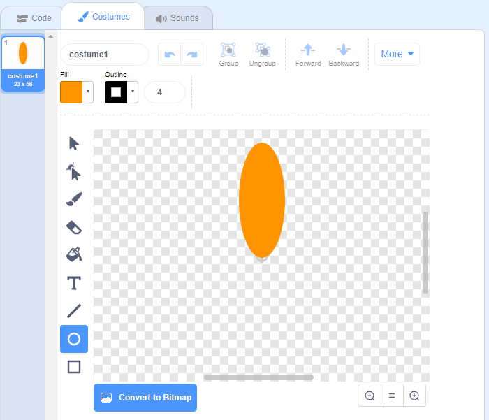
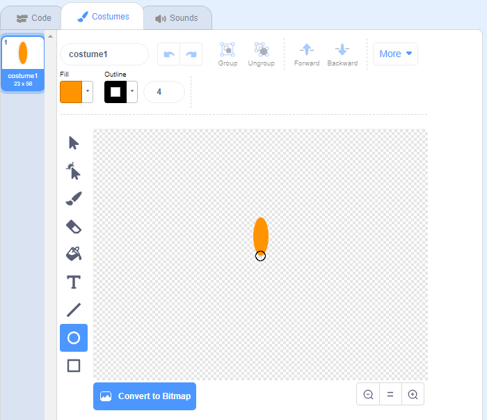

## Ustvari rožo

Najprej ustvari rožo, ki se bo lahko izrisala na odru.

\--- task \---

Ustvari nov Scratch projekt in izbriši figuro mačke.

[[[generic-scratch3-new-project]]]

\--- /task \---

\--- task \---

Projektu dodaj razširitev Svinčnik.

[[[generic-scratch3-add-pen-extension]]]

\--- /task \---

\--- task \---

Uporabi orodje Nariši da ustvariš novo figuro v obliki cvetnega lista oz. petala.

Klikni na **Izberi figuro**, nato klikni na **Nariši** in preimenuj figuro v 'Roža'.

[[[generic-scratch3-draw-sprite]]]

\--- /task \---

\--- task \---

Z orodjem Krog nariši obliko cvetnega lista, ki naj bo zapolnjen z oranžno barvo.



Kasneje boš s pomočjo kode dodal-a več barv.

\--- /task \---

\--- task \---

Figuri rože dodaj sledečo kodo, ki bo odtisnila `žig`{: class = "block3extensions"} cveta s šestimi enako zasukanimi cvetnimi listi `, ko bo kliknjena zelena zastavica`{: class = "block3control"}.


```blocks3
ko je kliknjena zelena zastavica
ponovi (6) krat 
  žig
  obrni se za (60) stopinj v desno
end
```

\--- /task \---

Nemara se ti bo zdelo, da so tvoji cvetni listi razporejeni zelo nenavadno:


Razlog je v tem, da se figura vrti okoli svojega središča.

\--- task \---

Premakni cvetni list, da bo njegovo dno v središču.



To je lažje narediti, če pomanjšaš pogled.

\--- /task \---

Preden znova zaženeš kodo, moraš `izbrisati vse`{: class = "block3extensions"} figure na odru, da ga očistiš.

\--- task \---

Klikni na blok `izbriši vse` v razdelku Svinčnik.

```blocks3
izbriši vse
```

\--- /task \---

\--- task \---

Ponovno zaženi kodo in preveri, ali so cvetni listi zdaj poravnani.


Če temu ni tako, spremeni položaj cveta, dokler njegova spodnja stran ne bo v centru.

\--- /task \---