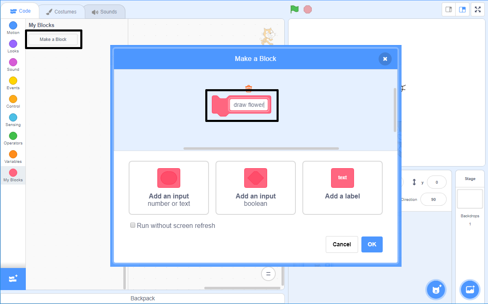

## Ustvari svoj blok za risanje rož

Kaj pa, če želiš narisati veliko rož? Namesto da ustvariš veliko število podvojene kode, lahko v Scratchu ustvariš svoj blok in ga uporabiš vsakič, ko bi rad narisal rožo.

\--- task \---

Klikni na **Moji bloki** in nato na **Ustvari blok**, da ustvariš svoj blok, imenovan "nariši rožo".



\--- /task \---

\--- task \---

Zdaj je v razdelku **Moji bloki** na voljo nov blok, imenovan `nariši rožo`{: class = "block3myblocks"}, na odru pa se nahaja nov blok za definicijo.

```blocks3
nariši rožo :: custom

definiraj nariši rožo
```

\--- /task \---

\--- task \---

Kodo za risanje rože premakni izpod bloka `ko kliknemo na zastavico`{: class = "block3events"} na novo definiran blok `nariši rožo`{: class = "block3myblocks"}.

Tvoja koda bi morala izgledati tako:


```blocks3
definiraj nariši rožo
ponovi (6) krat 
  žig
  obrni se za (60) stopinj v desno
end

ko je kliknjena zelena zastavica
```

\--- /task \---

\--- task \---

Dodaj kodo, ki počisti oder in uporabi tvoj novi blok `nariši rožo`{:class="block3myblocks"}, ko je kliknjena zelena zastavica:


```blocks3
ko je kliknjena zelena zastavica
izbriši vse
nariši rožo :: custom
```

\--- /task \---

\--- task \---

Klikni na zeleno zastavico, da preizkusiš kodo in preveri, da vidiš cvet.

\--- /task \---

\--- task \---

Spremeni kodo, da premakne figuro in nariši še eno rožo:


```blocks3
ko je kliknjena zelena zastavica
izbriši vse
pojdi na x: (75) y: (75)
nariši rožo :: custom
pojdi na x: (-75) y: (-75)
nariši rožo :: custom 
```

\--- /task \---

\--- task \---

Preizkusi kodo in preveri, da se prikažeta dva cvetova.


\--- /task \---