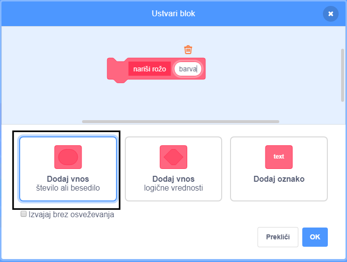

## Prilagodi svoje rože

Trenutno so vse rože, ki jih narišeš, popolnoma enake. Sedaj boš bloku `nariši rožo`{:class="block3myblocks"} dodal nekaj vnosov, da boš lahko narisal rože z različnih barv, velikosti in z različnim številom cvetnih listov.

\--- task \---

V Scratchu lahko uporabiš blok `nastavi barvni učinek`{: class = "block3looks"}, da spremeniš barvo figure.

Za spremembo barve, spremeni definicijo za "nariši rožo":


```blocks3
definiraj nariši rožo
nastavi učinek [barva v] na (150)
ponovi (6) krat 
  žig
  obrni se za (60) stopinj v desno
konec
```

\--- /task \---

\--- task \---

Zaženi kodo in videl boš cvetje različnih barv.


`nastavi učinek barva`{: class = "block3looks"} spremeni barvo glede na izhodiščno barvo figure, zato bodo rezultati drugačni, če ta ni oranžna.

\--- /task \---

\--- task \---

Uporabi različna števila med `0` in `199` v bloku `nastavi učinek barva`{:class="block3looks"} in opazuj, kako se razlikujejo rezultati.

\--- /task \---

Trenutno so vse rože iste barve. Da bi vsaka roža bila drugačne barve, moraš dodati **vnos** bloku `nariši rožo`{: class = "block3myblocks"}.

\--- task \---

Z desno tipko miške klikni na definicijski blok `nariši rožo`{: class = "block3myblocks"} in izberi **Uredi**:


\--- /task \---

\--- task \---

Zdaj dodaj **vnos številke**, imenovan "barva":



Vnos se pojavi v definiciji `nariši rožo`{: class = "block3myblocks"} in ga lahko povlečeš tja, kjer ga želiš uporabiti.

\--- /task \---

\--- task \---

Povleči vnos 'barva' na blok `nastavi učinek barva`{: class = "block3looks"}:


Tvoja koda bi morala izgledati tako:


```blocks3
definiraj nariši rožo (barva :: custom-arg)
nastavi učinek [barva v] na (barva :: custom-arg)
ponovi (6) krat 
  žig
  obrni se za (60) stopinj v desno
konec
```

\--- /task \---

Upoštevaj, da imajo tvoji bloki `nariši rožo`:: class = "block3myblocks"} sedaj nov vnos, ki je nastavljen na `1`:

```blocks3
ko je kliknjena zelena zastavica
izbriši vse
pojdi na x: (75) y: (75)
nariši rožo (1) :: custom
pojdi na x: (-75) y: (-75)
nariši rožo (1) :: custom
```

\--- task \---

Spremeni številke v blokih `nariši rožo`:: class = "block3myblocks"}, da se roži pojavita v različnih barvah. Izbereš lahko poljubne številke med 0 in 200.

Tvoja koda bi morala biti podobna tej:


```blocks3
ko je kliknjena zelena zastavica
izbriši vse
pojdi na x: (75) y: (75)
nariši rožo (180) :: custom
pojdi na x: (-75) y: (-75)
nariši rožo (150) :: custom
```

\--- /task \---

\--- task \---

Dodaj še en vnos, ki določi velikost rože, tako da bo tvoj blok `nariši rožo`{: class = "block3myblocks"} izgledal tako:


```blocks3
nariši rožo (180) (150) :: custom
```

Z zgornjim blokom lahko ustvariš rože različnih velikosti:


\--- hints \---

\--- hint \---

Na enak način, kot si dodal-a vnos `barva` dodaj še vnos 'velikost', ki ga lahko uporabiš za nastavitev velikosti figure rože.

\--- /hint \---

\--- hint \---

Uredi blok `nariši rožo`{: class = "block3myblocks"} in dodaj nov vnos številke, imenovan "velikost".

Defincijskemu bloku `nariši rožo`{: class = "block3myblocks"} moraš dodati sledeči blok z vnosom 'velikost':

```blocks3
nastavi velikost na (100)%
```

\--- /hint \---

\--- hint \---

Z desno tipko miške klikni na definicijski blok `nariši rožo`{: class = "block3myblocks"}, klikni na **Uredi**in dodaj vnos številke in ga poimenuj "velikost".


Spremeni skript za `nariši rožo`{: class = "block3myblocks"}, da bo videti tako:

```blocks3
definiraj nariši rožo (barva :: custom-arg) (barva :: custom-arg)
nastavi učinek [barva v] na (barva :: custom-arg)
nastavi velikost na (velikost :: custom-arg) %
ponovi (6) krat 
  žig
  obrni se za (60) stopinj v desno
konec
```

\--- /hint \---

\--- /hints \---

\--- /task \--- \--- task \---

In the `when green flag clicked`{:class="block3events"} script, change the second number in both `draw flower`{:class="block3myblocks"} blocks so that the two flowers appear in different sizes.

```blocks3
ko kliknete zeleno zastavo
zbrišite vse
pojdite na x: (75) y: (75)
narišite cvet (180) (150) :: po meri
pojdite na x: (-75) y: (-75)
narišite rožo (150) (50) :: po meri
```

\--- /task \---

\--- task \---

Test your code to check whether the flowers have different sizes.

\--- /task \---

\--- task \---

It would be cool to choose the number of petals the flowers have.

Add another input so that you can draw flowers like this:


\--- hints \--- \--- hint \---

You need to add a 'petals' number input, and then use it in the `define draw flower`{:class="block3myblocks"} block.

There are two places where you need to add the 'petals' input.

The number of degrees the Flower sprite should `turn`{:class="block3looks"} by is `360` divided by the number of petals.

\--- /hint \---

\--- hint \---

Change your `define draw flower`{:class="block3myblocks"} block to look like this:


```blocks3
definiraj nariši rožo (barva :: custom-arg) (velikost :: custom-arg) (petalov :: custom-arg)
```

Update your `repeat`{:class="block3control"} and `turn`{:class="block3looks"} blocks so they use the 'petals' input.

```blocks3
ponovite (cvetni listi: custom-arg) 
konec

obrat cw ((360) / (cvetni listi: custom-arg)) stopnje
```

Update your `draw flower`{:class="block3myblocks"} blocks to use the 'petals' input.

```blocks3
nariši rožo (150) (50) (8) :: po meri
```

\--- /hint \---

\--- hint \---

Edit your `define draw flower`{:class="block3myblocks"} block and add a new number input called 'petals'.


Your code should look like this:

```blocks3
definiraj nariši rožo (barva :: custom-arg) (velikost :: custom-arg) (petalov :: custom-arg)
nastavi učinek [barva v] na (barva :: custom-arg)
nastavi velikost na (velikost :: custom-arg) %
ponovi (petalov :: custom-arg) krat 
  žig
  obrni se za ((360) / (petalov :: custom-arg)) stopinj v desno
konec

```

In the `when green flag clicked`{:class="block3events"} script, change the third number in both `draw flower`{:class="block3myblocks"} blocks so that the two flowers that appear have different numbers of petals.

```blocks3
ko je kliknjena zelena zastavica
izbriši vse
pojdi na x: (75) y: (75)
nariši rožo (180) (150) (3) :: custom
pojdi na x: (-75) y: (-75)
nariši rožo (150) (50) (8) :: custom
```

\--- /hint \---

\--- /hints \---

\--- /task \---

Next, edit your code so you can draw different flowers by pressing the <kbd>f</kbd> key.

\--- task \---

Now move your code for drawing flowers away from below the `when green flag clicked`{:class="block3events"} block, and put the code under a `when f key pressed`{:class="block3events"} block.


```blocks3
ko je kliknjena zelena zastavica
```

```blocks3
ko je pritisnjena tipka [f v]
izbriši vse
pojdi na x: (75) y: (75)
nariši rožo (180) (150) (3) :: custom
pojdi na x: (-75) y: (-75)
nariši rožo (150) (50) (8) :: custom
```

\--- /task \---

\--- task \---

Press <kbd>f</kbd> to test your code.

\--- /task \---

\--- task \---

Add more `draw flower`{:class="block3myblocks"} blocks to your program to draw flowers with different colours, sizes, and numbers of petals all over the Stage.

\--- /task \---