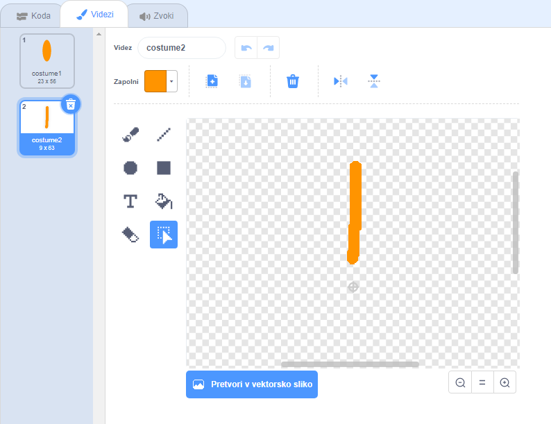

## Izziv: ustvari cvetlični aranžma

Ali lahko uporabiš tvoj blok `nariši rožo`{: class = "block3myblocks"}, da narišeš več rož in ustvariš zanimiv dizajn? Risanje različnih rož na istem mestu ustvarja zanimiv učinek.

Ustvari dizajn, ki ti je všeč. To je primer:

Ni ti treba uporabljati cvetnih listov v obliki elipse. Lahko denimo uporabiš dbele ravne črte s črnim ozadjem, ki ustvarja videz podoben ognjemetu:

'Petal' za obliko ognjemeta je zgolj črta:

Dodaj nove videze cvetnih listov in si oglej, kakno cvetje vse lahko ustvariš.

Preizkusi obliko figure, ki ni zapolnjena, kot npr. kvadrat in si oglej, kaj se zgodi

