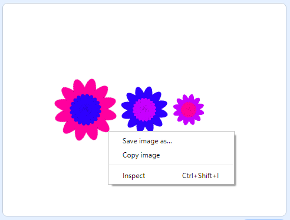

## Shrani svoje slike

Ko ustvariš sliko, ki ti je všeč, jo lahko shraniš in uporabiš v drugem Scratch projektu, ali kot ohranjevalnik zaslona, ali za spletno stran.

\--- task \---

Ko je na odru slika, ki ti je všeč, klikni nanjo z desno tipko miške in nato klikni na **shrani sliko kot**

**Opomba:** na nekaterih računalnikih ali brskalnikih je lahko opcija za shranjevanje slike poimenovana drugače.

Tako lahko shraniš sliko odra kot PNG sliko.

\--- /task \---