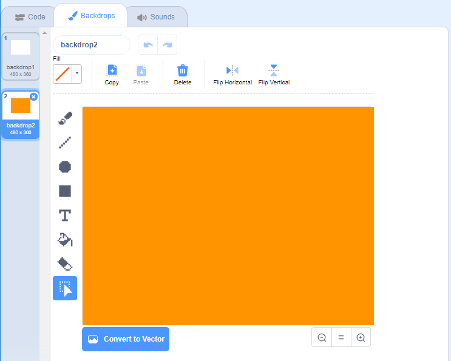

## Cvetni vzorci

Lahko uporabite tudi blok `draw flower`{: class = "block3myblocks"}, da ustvarite čedne vzorce cvetov.

\--- task \---

Ustvari cvet ali kombinacijo cvetov, ki ti je všeč. Tukaj je primer:


```blocks3
ko pritisnete tipko [pv]
izbrišite vse
pojdite na x: (-150) y: (100)
narišite rožo (150) (80) (7) ::
ročice po meri narišite (130) (35) (20) :: po meri
```

\--- /task \---

\--- task \---

Pritisnite <kbd>p</kbd> da vidite svojo rožo. Primer je videti tako:


\--- /task \---

Preden lahko ustvarite svoj vzorec, počistite fazo vseh preostalih cvetov.

\--- task \---

Kliknite zavihek `zbriši vseh` na zavihku Pen.

```blocks3
izbrisati vse
```

\--- /task \---

\--- task \---

Z desno miškino tipko kliknite rožico Flower in `skrite`{: class = "block3looks"}, da se ne prikaže na odru. (Lahko `predstava`{: class = "block3looks"}. Sprite ponovno, če želite videti, kje je to)

\--- /task \---

\--- task \---

Zdaj narišite vrstico teh cvetov čez vrh Stage. Tu je nekaj primerov kode, v katerih boste morda morali prilagoditi številke, da bo delovala z vašo rožo:


```blocks3
ko pritisnete tipko [pv]
izbrišite vse
pojdite na x: (-150) y: (100)
ponovite (4) 
  narišite cvet (150) (80) (7) :: po meri
  narišite cvet (130) ( 35) (20) :: po meri
  spremenite x za (100)
konec
```

\--- /task \---

\--- task \---

Pritisnite `p` če si želite ogledati vrsto cvetov:


\--- /task \---

\--- task \---

Dodajte še eno zanko, da ustvarite več vrstic cvetov. Ta primer doda zanko `ponovitve 3`{: class = "block3control"}, da ustvarite tri vrstice.


```blocks3
ko pritisnete tipko [pv]
izbrišite vse
pojdite na x: (-150) y: (100)
ponovite (3) 
  ponovite (4) 
    narišite cvet (150) (80) (7) :: po meri
    narišite cvet (130) (35) (20) :: po meri
    sprememba x za (100)
  konec
  nastavitev x v (-150)
  sprememba y za (-100)
konec
```

\--- /task \---

\--- task \---

Pritisnite <kbd>p</kbd> da ustvarite mrežo rož:


\--- /task \---

Ali želite pospešiti risanje cvetov?

\--- task \---

Right-click on the `draw flower`{:class="block3myblocks"} definition block and then click on **edit**. Click on the **Run without screen refresh** box.


Now the flowers get drawn more quickly.

\--- /task \---

You can also change the colour of the Stage.

\--- task \---

Click on **Choose a backdrop**, and then click on **Paint**. Create an orange backdrop by using the Fill tool in Bitmap mode.



If you use orange for the backdrop and the Flower sprite, then the numbers for different colours will match for the sprite and the backdrop.

\--- /task \---

\--- task \---

Now you can use the `set colour effect`{:class="block3looks"} on the Stage to change the colour of the backdrop.


```blocks3
ko pritisnete tipko [pv]
nastavite [barva v] učinek na (30)
```

\--- /task \---

\--- task \---

Try to create a pattern you like.

Here's an example:


\--- /task \---

When you put it all together, you can create an amazing effect:

