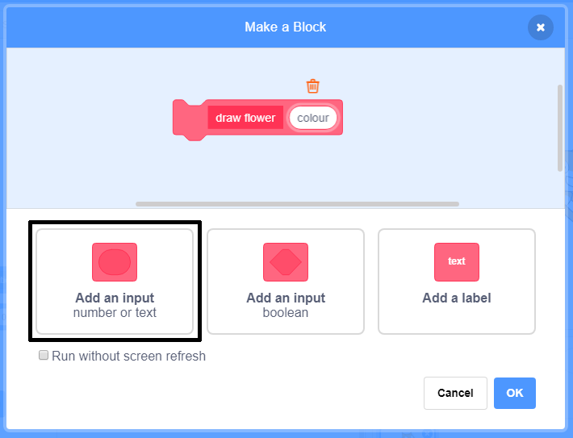
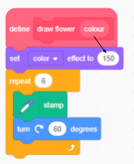

## Customise your flowers

At the moment all the flowers you draw are exactly the same. Next you're going to add some inputs to the `draw flower`{:class="block3myblocks"} block so that you can draw flowers with different colours, sizes, and numbers of petals.

\--- task \---

In Scratch you can use the `set colour effect`{:class="block3looks"} block to change the colour of a sprite.

Change your 'draw flower' definition to change the colour:


```blocks3
define draw flower
set [color v] effect to (150)
repeat (6) 
  stamp
  turn cw (60) degrees
end
```

\--- /task \---

\--- task \---

Run your code to see flowers of different colours.


`set colour effect`{:class="block3looks"} changes the colour based on the default colour of the sprite, so if your sprite doesn't start out orange, you get different results.

\--- /task \---

\--- task \---

Experiment with using different numbers from `0` to `199` in the `set colour effect`{:class="block3looks"} block, and see what different results you get.

\--- /task \---

At the moment all flowers are the same colour. To give each flower a different colour, you need to add an **input** to the `draw flower`{:class="block3myblocks"} block.

\--- task \---

Right-click on the `draw flower`{:class="block3myblocks"} definition block and choose **edit**:


\--- /task \---

\--- task \---

Now add a **input number** called 'colour':



The input appears in the `draw flower`{:class="block3myblocks"} definition, and you can drag it to where you want to use it.

\--- /task \---

\--- task \---

Drag the 'colour' input to the `set colour effect`{:class="block3looks"} block:



Your code should look like this:


```blocks3
define draw flower (colour)
set [color v] effect to (colour :: custom-arg)
repeat (6)
  stamp
  turn cw (60) degrees
end
```

\--- /task \---

Notice that your `draw flower`{:class="block3myblocks"} blocks now have a new input that is set to `1`:

```blocks3
when green flag clicked
erase all
go to x: (75) y: (75)
draw flower (1) :: custom
go to x: (-75) y: (-75)
draw flower (1) :: custom
```

\--- task \---

Change the numbers in the `draw flower`{:class="block3myblocks"} blocks so that the two flowers appear in different colours. You can pick any numbers between 0 and 200.

Your code should look similar to this:


```blocks3
when green flag clicked
erase all
go to x: (75) y: (75)
draw flower (180) :: custom
go to x: (-75) y: (-75)
draw flower (150) :: custom
```

\--- /task \---

\--- task \---

Now add another input to set the size of the flower, so your `draw flower`{:class="block3myblocks"} block looks like this:


```blocks3
draw flower (180) (150) :: custom
```

With the block above, you can create flowers with different sizes:


\--- hints \---

\--- hint \---

Look at what you did to add the `colour` input, and repeat it to add a 'size' input that you can use to set the size of the Flower sprite.

\--- /hint \---

\--- hint \---

Edit the `draw flower`{:class="block3myblocks"} block to add a new number input called 'size'.

You need to add the following block with a 'size' input to the `draw flower`{:class="block3myblocks"} definition block:

```blocks3
set size to (100) %
```

\--- /hint \---

\--- hint \---

Right-click on the `draw flower`{:class="block3myblocks"} definition block, click on **edit**, and add a number input called 'size'.


Change your `define draw flower`{:class="block3myblocks"} script so it looks like this:

```blocks3
define draw flower (colour) (size :: custom-arg)
set [color v] effect to (colour :: custom-arg)
set size to (size :: custom-arg) %
repeat (6) 
  stamp
  turn cw (60) degrees
end
```

\--- /hint \---

\--- /hints \---

\--- /task \--- \--- task \---

In the `when green flag clicked`{:class="block3events"} script, change the second number in both `draw flower`{:class="block3myblocks"} blocks so that the two flowers appear in different sizes.

```blocks3
when green flag clicked
erase all
go to x: (75) y: (75)
draw flower (180) (150) :: custom
go to x: (-75) y: (-75)
draw flower (150) (50) :: custom
```

\--- /task \---

\--- task \---

Test your code to check whether the flowers have different sizes.

\--- /task \---

\--- task \---

It would be cool to choose the number of petals the flowers have.

Add another input so that you can draw flowers like this:


\--- hints \--- \--- hint \---

You need to add a 'petals' number input, and then use it in the `define draw flower`{:class="block3myblocks"} block.

There are two places where you need to add the 'petals' input.

The number of degrees the Flower sprite should `turn`{:class="block3looks"} by is `360` divided by the number of petals.

\--- /hint \---

\--- hint \---

Change your `define draw flower`{:class="block3myblocks"} block to look like this:


```blocks3
define draw flower (colour) (size :: custom-arg) (petals)
```

Update your `repeat`{:class="block3control"} and `turn`{:class="block3looks"} blocks so they use the 'petals' input.

```blocks3
repeat (petals :: custom-arg) 
end

turn cw ((360) / (petals :: custom-arg)) degrees
```

Update your `draw flower`{:class="block3myblocks"} blocks to use the 'petals' input.

```blocks3
draw flower (150) (50) (8) :: custom
```

\--- /hint \---

\--- hint \---

Edit your `define draw flower`{:class="block3myblocks"} block and add a new number input called 'petals'.


Your code should look like this:

```blocks3
define draw flower (colour) (size :: custom-arg) (petals)
set [color v] effect to (colour :: custom-arg)
set size to (size :: custom-arg) %
repeat (petals :: custom-arg) 
  stamp
  turn cw ((360) / (petals :: custom-arg)) degrees
end

```

In the `when green flag clicked`{:class="block3events"} script, change the third number in both `draw flower`{:class="block3myblocks"} blocks so that the two flowers that appear have different numbers of petals.

```blocks3
when green flag clicked
erase all
go to x: (75) y: (75)
draw flower (180) (150) (3) :: custom
go to x: (-75) y: (-75)
draw flower (150) (50) (8) :: custom
```

\--- /hint \---

\--- /hints \---

\--- /task \---

Next, edit your code so you can draw different flowers by pressing the <kbd>f</kbd> key.

\--- task \---

Now move your code for drawing flowers away from below the `when green flag clicked`{:class="block3events"} block, and put the code under a `when f key pressed`{:class="block3events"} block.


```blocks3
when green flag clicked
```

```blocks3
when [f v] key pressed
erase all
go to x: (75) y: (75)
draw flower (180) (150) (3) :: custom
go to x: (-75) y: (-75)
draw flower (150) (50) (8) :: custom
```

\--- /task \---

\--- task \---

Press <kbd>f</kbd> to test your code.

\--- /task \---

\--- task \---

Add more `draw flower`{:class="block3myblocks"} blocks to your program to draw flowers with different colours, sizes, and numbers of petals all over the Stage.

\--- /task \---