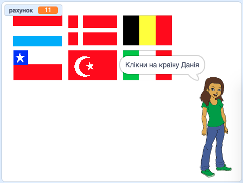

## Що далі?

Спробуй наш проєкт [Вгадай прапор](https://projects.raspberrypi.org/uk-UA/projects/guess-the-flag?utm_source=pathway&utm_medium=whatnext&utm_campaign=projects), де ти зможеш створити тест про прапори, щоб перевірити себе та своїх друзів.

--- no-print ---

Клацни на прапор країни, про яку тебе запитують.

  <iframe allowtransparency="true" width="485" height="402" src="https://scratch.mit.edu/projects/embed/276891625/?autostart=false" frameborder="0" scrolling="no"></iframe>

--- /no-print ---

--- print-only ---

--- /print-only ---

***
Цей проєкт переклали волонтери:

Володимир Соботович

Павло Фесенко

Завдяки волонтерам, ми надаємо можливість людям у всьому світі навчатися рідною мовою. Ви також можете допомогти нам у цьому — більше інформації про волонтерську програму на [rpf.io/translate](https://rpf.io/translate).