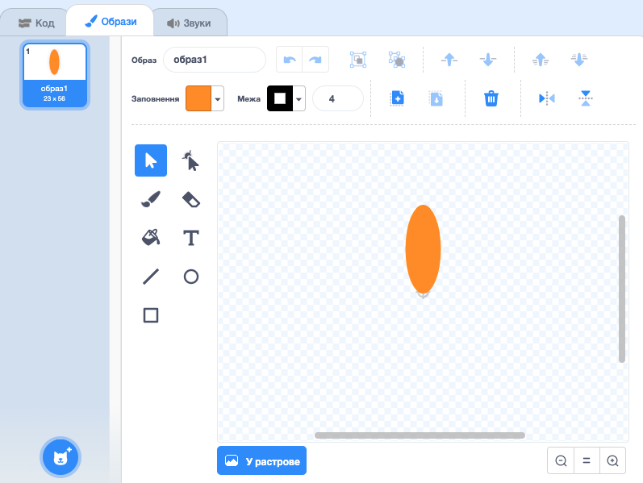
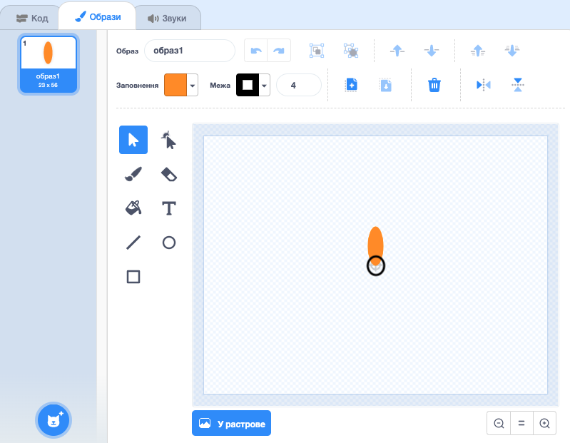

## Згенеруй квітку

Спочатку ти згенеруєш квітку, яку можна буде малювати на Сцені.

\--- task \---

Створи новий проєкт Скретч і видали спрайт кота.

[[[generic-scratch3-new-project]]]

\--- /task \---

\--- task \---

Додай розширення Олівець до свого проєкту.

[[[generic-scratch3-add-pen-extension]]]

\--- /task \---

\--- task \---

Тепер використай вбудований інструмент для малювання, щоб створити новий спрайт у формі квіткової пелюстки.

Клацни **Обрати спрайт**, далі вибери **Малювати** і назви спрайт "Квітка".

[[[generic-scratch3-draw-sprite]]]

\--- /task \---

\--- task \---

Використовуй інструмент Коло, щоб намалювати контур пелюстки, заповнений оранжевим кольором.



Далі, за допомогою коду ти зможеш додати більше кольорів.

\--- /task \---

\--- task \---

Додай наступний код до спрайта квітки, щоб зробити її `штамп`{:class="block3extensions"} з шістьома рівномірно розподіленими пелюстками, `коли зелений прапор натиснуто`{:class="block3control"}.


```blocks3
when green flag clicked
repeat (6) 
  stamp
  turn cw (60) degrees
end
```

\--- /task \---

Може виявитися, що твої пелюстки розміщені дивним чином:


Це тому, що спрайт обертається навколо власного центру.

\--- task \---

Перемісти свою пелюстку, щоб її низ був у центрі спрайта.



Це може бути легше зробити, якщо змінити масштаб.

\--- /task \---

Перед повторним запуском свого коду, тобі треба `очистити всі`{:class="block3extensions"} спрайти зі сцени.

\--- task \---

Клацни на блок `очистити все` в розділі Олівець.

```blocks3
erase all
```

\--- /task \---

\--- task \---

Запусти свій код знову, щоб переконатися, що квіткові пелюстки тепер прямі.


Якщо ні, то змінюй розміщення пелюстки, поки її низ не опиниться в центрі спрайта.

\--- /task \---